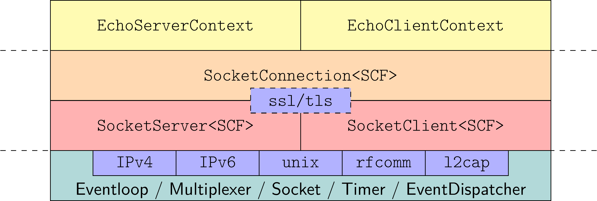

# Simple NODE in C++ (SNode.C)

[SNode.C](https://snodec.github.io/snode.c-doc/html/index.html) is a very simple to use, lightweight, highly extensible, event driven, layer-based framework for network applications in the spirit of node.js written entirely in C\+\+.

The development of the  framework began during the summer semester 2020 as part of the course *Network and Distributed Systems* in the master's program [Interactive Media](https://www.fh-ooe.at/en/hagenberg-campus/studiengaenge/master/interactive-media/) at the department [Informatics, Communications and Media](https://www.fh-ooe.at/en/hagenberg-campus/) at the [University of Applied Sciences Upper Austria, Campus Hagenberg](https://www.fh-ooe.at/en/), to give students an insight into the fundamental techniques of network and web frameworks.

Main focus (but not only) of the framework is on *Machine to Machine* (M2M) communication and in particular on the field of *Internet of Things* (IoT). As such, the SNode.C reference project [MQTT-Suite](https://github.com/SNodeC/mqttsuite) exists, which provides *mqttbroker*, *mqttintegrator*, and *wsmqttintegrator*, *mqttbridge*, and *wsmqttbridge* applications.

# Table of Content
<!--ts-->
* [Simple NODE in C++ (SNode.C)](#simple-node-in-c-snodec)
* [Table of Content](#table-of-content)
* [License](#license)
* [Copyright](#copyright)
* [Quick Starting Guide](#quick-starting-guide)
   * [An "Echo" Application](#an-echo-application)
      * [SocketServer and SocketClient Instances](#socketserver-and-socketclient-instances)
      * [SocketContextFactory Classes](#socketcontextfactory-classes)
         * [Echo-Server SocketContextFactory](#echo-server-socketcontextfactory)
         * [Echo-Client SocketContextFactory](#echo-client-socketcontextfactory)
      * [SocketContext Classes](#socketcontext-classes)
         * [Echo-Server SocketContext](#echo-server-socketcontext)
         * [Echo-Client SocketContext](#echo-client-socketcontext)
      * [Main Applications for Server and Client](#main-applications-for-server-and-client)
         * [Echo-Server Main Application](#echo-server-main-application)
         * [Echo-Client Main Application](#echo-client-main-application)
      * [CMakeLists.txt file for Building and Installing our <em>echoserver</em> and <em>echoclient</em>](#cmakeliststxt-file-for-building-and-installing-our-echoserver-and-echoclient)
   * [Summary](#summary)
* [Installation](#installation)
   * [Supported Systems and Hardware](#supported-systems-and-hardware)
   * [Minimum required Compiler Versions](#minimum-required-compiler-versions)
   * [Requirements and Dependencies](#requirements-and-dependencies)
      * [Tools](#tools)
         * [Mandatory](#mandatory)
         * [Optional](#optional)
      * [Libraries](#libraries)
         * [Mandatory](#mandatory-1)
         * [Optional](#optional-1)
         * [In-Framework](#in-framework)
   * [Installation on Debian Style Systems (x86-64, Arm)](#installation-on-debian-style-systems-x86-64-arm)
      * [Requirements and Dependencies](#requirements-and-dependencies-1)
      * [SNode.C](#snodec)
   * [Deploment on OpenWRT](#deploment-on-openwrt)
      * [Choose and Download a SDK](#choose-and-download-a-sdk)
      * [Patch the SDK to Integrate the SNode.C Feed](#patch-the-sdk-to-integrate-the-snodec-feed)
      * [Install the SNode.C Package and its Dependencies](#install-the-snodec-package-and-its-dependencies)
      * [Configure the SDK](#configure-the-sdk)
      * [Cross Compile SNode.C](#cross-compile-snodec)
      * [Deploy SNode.C](#deploy-snodec)
* [Design Decisions and Features](#design-decisions-and-features)
* [Fundamental Architecture](#fundamental-architecture)
   * [Network Layer](#network-layer)
   * [Transport Layer](#transport-layer)
   * [Connection Layer](#connection-layer)
   * [Application Layer](#application-layer)
* [Existing SocketServer and SocketClient Classes](#existing-socketserver-and-socketclient-classes)
   * [Common Aspects of SocketServer and SocketClient Classes](#common-aspects-of-socketserver-and-socketclient-classes)
      * [SocketAddress](#socketaddress)
         * [SocketAddress Constructors](#socketaddress-constructors)
      * [SocketConnection](#socketconnection)
         * [Most Important common SocketConnection Methods](#most-important-common-socketconnection-methods)
      * [Constructors of SocketServer and SocketClient Classes](#constructors-of-socketserver-and-socketclient-classes)
         * [All Constructors of SocketServer Classes](#all-constructors-of-socketserver-classes)
         * [All Constructors of SocketClient Classes](#all-constructors-of-socketclient-classes)
      * [Constructor Callbacks](#constructor-callbacks)
         * [The onConnect Callback](#the-onconnect-callback)
         * [The onConnected Callback](#the-onconnected-callback)
         * [The onDisconnected Callback](#the-ondisconnected-callback)
         * [Attaching the Callbacks during Instance Creation](#attaching-the-callbacks-during-instance-creation)
         * [Attaching the Callbacks to already existing Instances](#attaching-the-callbacks-to-already-existing-instances)
   * [SocketServer Classes](#socketserver-classes)
      * [SocketServer Header Files](#socketserver-header-files)
      * [Listen Methods](#listen-methods)
         * [SocketAddress Types](#socketaddress-types)
         * [The core::socket::State Object](#the-coresocketstate-object)
         * [Common listen() Methods](#common-listen-methods)
         * [IPv4 specific listen() Methods](#ipv4-specific-listen-methods)
         * [IPv6 specific listen() Methods](#ipv6-specific-listen-methods)
         * [Unix Domain Socket specific listen() Methods](#unix-domain-socket-specific-listen-methods)
         * [Bluetooth RFCOMM specific listen() Methods](#bluetooth-rfcomm-specific-listen-methods)
         * [Bluetooth L2CAP specific listen() Methods](#bluetooth-l2cap-specific-listen-methods)
   * [SocketClient Classes](#socketclient-classes)
      * [SocketClient Header Files](#socketclient-header-files)
      * [Connect Methods](#connect-methods)
         * [SocketAddress Types](#socketaddress-types-1)
         * [The core::socket::State Object](#the-coresocketstate-object-1)
         * [Common connect() Methods](#common-connect-methods)
         * [IPv4 specific connect() Methods](#ipv4-specific-connect-methods)
         * [IPv6 specific connect() Methods](#ipv6-specific-connect-methods)
         * [Unix Domain Socket specific connect() Methods](#unix-domain-socket-specific-connect-methods)
         * [Bluetooth RFCOMM specific connect() Methods](#bluetooth-rfcomm-specific-connect-methods)
         * [Bluetooth L2CAP specific connect() Methods](#bluetooth-l2cap-specific-connect-methods)
* [Configuration](#configuration)
   * [Three different Options for Configuration](#three-different-options-for-configuration)
      * [Configuration using the C++ API](#configuration-using-the-c-api)
         * [List of all Configuration Items](#list-of-all-configuration-items)
      * [Configuration via the Command Line](#configuration-via-the-command-line)
         * [Application Configuration](#application-configuration)
         * [Instance Configuration](#instance-configuration)
            * [Sections](#sections)
            * [Using the Parameterless listen() Methods when no Configuration File exists](#using-the-parameterless-listen-methods-when-no-configuration-file-exists)
            * [Using the Parameterless connect() Methods when no Configuration File exists](#using-the-parameterless-connect-methods-when-no-configuration-file-exists)
         * [Anatomy of the Command Line Interface](#anatomy-of-the-command-line-interface)
      * [Configuration via a Configuration File](#configuration-via-a-configuration-file)
         * [Configuration File Format](#configuration-file-format)
         * [Default Name of a Configuration File](#default-name-of-a-configuration-file)
         * [Default Location of Configuration Files](#default-location-of-configuration-files)
   * [Important Configuration Sections](#important-configuration-sections)
      * [SSL/TLS Configuration (Section <em>tls</em>)](#ssltls-configuration-section-tls)
         * [SSL/TLS In-Code Configuration](#ssltls-in-code-configuration)
         * [SSL/TLS Command Line Configuration](#ssltls-command-line-configuration)
         * [Using SSL/TLS with Other Network Layers](#using-ssltls-with-other-network-layers)
      * [Socket Configuration (Section <em>socket</em>)](#socket-configuration-section-socket)
         * [Common <em>socket</em> Options for <em>SocketServer</em> and <em>SocketClient</em> Instances](#common-socket-options-for-socketserver-and-socketclient-instances)
         * [Specific <em>socket</em> Options for IPv4 and IPv6 <em>SocketServer</em>](#specific-socket-options-for-ipv4-and-ipv6-socketserver)
         * [Specific <em>socket</em> Options for IPv6 <em>SocketServer</em> and <em>SocketClient</em>](#specific-socket-options-for-ipv6-socketserver-and-socketclient)
* [Using More Than One Instance in an Application](#using-more-than-one-instance-in-an-application)
* [Application Leyer Protocols APIs](#application-leyer-protocols-apis)
   * [Basic HTTP-Server and HTTP-Client API](#basic-http-server-and-http-client-api)
   * [Highlevel WEB-API a'la Node.JS-Express](#highlevel-web-api-ala-nodejs-express)
   * [WebSockets](#websockets)
   * [Basic MQTT-Server and MQTT-Client API](#basic-mqtt-server-and-mqtt-client-api)
   * [MQTT Over WebSocket](#mqtt-over-websocket)
* [Database Support](#database-support)
   * [MariaDB](#mariadb)
* [Example Applications](#example-applications)
   * [HTTP/S Web-Server for Static HTML-Pages](#https-web-server-for-static-html-pages)
   * [Receive Data via HTTP-Post Request](#receive-data-via-http-post-request)
   * [Extract Server and Client Information (host name, IP, port, SSL/TLS information)](#extract-server-and-client-information-host-name-ip-port-ssltls-information)
   * [Using Regular Expressions in Routes](#using-regular-expressions-in-routes)

<!-- Created by https://github.com/ekalinin/github-markdown-toc -->
<!-- Added by: runner, at: Fri Jul 19 19:55:28 UTC 2024 -->

<!--te-->

# License

SNode.C is released under the [GNU Lesser General Public License, Version 3](https://www.gnu.org/licenses/lgpl-3.0.html.en).

# Copyright

Volker Christian ([me@vchrist.at](mailto:me@vchrist.at) or [Volker.Christian@fh-hagenberg.at](mailto:volker.christian@fh-hagenberg.at))

Some components are also copyrighted by students:

-   Json Middleware

    -   Marlene Mayr

    -   Anna Moser

    -   Matteo Prock

    -   Eric Thalhammer

-   Regular-Expression Route-Mapping

    -   Joelle Helgert

    -   Julia Gruber

    -   Patrick Brandstätter

    -   Fabian Mohr

-   MariaDB Database Support

    -   Daniel Flockert

-   OAuth2 Demo System

    -   Daniel Flockert

# Quick Starting Guide

The architecture of every server and client application is basically the same and consists of three components.

-   `SocketServer` respective `SocketClient` instance
-   `SocketContextFactory`
-   `SocketContext`

Let\'s have a look at how these components are related to each other by implementing a simple networking application.

## An "Echo" Application

Imagine we want to create a very basic TCP (`stream`)/IPv4 (`in`) server/client pair which sends some plain text data unencrypted (`legacy`) to each other in a ping-pong fashion.

The client starts to send text data to the server and the server reflects this data back to the client. The client receives the reflected data and sends it back to the server again. This data-ping-pong should last infinitely long.

The code of this demo application can be found on [github](https://github.com/SNodeC/echo).

### `SocketServer` and `SocketClient` Instances

For the *server role* we just need to create an object of type

``` c++
net::in::stream::legacy::SocketServer<SocketContextFactory>
```

called [*server instance*](#SocketServer-Classes) and for the *client role* an object of type

``` c++
net::in::stream::legacy::SocketClient<SocketContextFactory>
```

is required, called [*client instance*](#SocketClient-Classes).

A class `SocketContextFactory` is used for both instances as template argument. Such a `SocketContextFactory` needs to be provided by the user and is used internally by the `SocketServer` and the `SocketClient` instances to create a concrete `SocketContext` object for each established connection.

The `SocketContext` class must also be provided by the user and represents a concrete application protocol.

Both, `SocketServer` and `SocketClient` classes have, among others, a *default constructor* and a constructor expecting an *instance name* as argument. 

- In case the *default* constructor is used to create the instance, it is called an *anonymous instance*.
- In contrast to a *named instance* if the constructors expecting a `std::string` is used. 
- For named instances *command line arguments* and *configuration file entries* are created automatically.

Therefore, for our *echo* application, we need to implement the *application protocol* for server and client in classes derived from `core::socket::stream::SocketContext`, the base class of all connection-oriented (`stream`) application protocols, and factories derived from `core::socket::stream::SocketContextFactory`.

### `SocketContextFactory` Classes

Let\'s focus on the `SocketContextFactory` classes for our server and client first.

All what needs to be done is to *implement a pure virtual method* `create()` witch expects a pointer to a `core::socket::stream::SocketConnection` as argument and returns a pointer to a concrete `SocketContext`.

The `core::socket::stream::SocketConnection` object involved is managed internally by SNode.C and *represents the network connection* between a server and a client. It is responsible for handling the *physical data exchange* and, in case of a SSL/TLS-secured connection, for *encryption* resp. *decryption*.

#### Echo-Server `SocketContextFactory`

The `create()` method of our `EchoServerContextFactory` returns a pointer to the `EchoServerContext` whose implementation is presented in the [SocketContext Classes](#socketcontext-classes) section below.

***Note***: A pointer to a  `core::socket::stream::SocketConnection` is passed as argument to the constructor of our `EchoServerContext`.

``` c++
#include "EchoServerContext.h"
#include <core/socket/stream/SocketContextFactory.h>

class EchoServerContextFactory : public core::socket::stream::SocketContextFactory {
private:
    core::socket::stream::SocketContext* create(core::socket::stream::SocketConnection* socketConnection) override {
        return new EchoServerContext(socketConnection);
    }
};
```

#### Echo-Client `SocketContextFactory`

The `create()` method of our `EchoClientContextFactory` returns a pointer to the `EchoClientContext` whose implementation is also presented in the [SocketContext Classes](#socketcontext-classes) section below.

***Note***: A pointer to a  `core::socket::stream::SocketConnection` is passed as argument to the constructor of our `EchoServerContext`.

``` c++
#include "EchoClientContext.h"
#include <core/socket/stream/SocketContextFactory.h>

class EchoClientContextFactory : public core::socket::stream::SocketContextFactory {
private:
    core::socket::stream::SocketContext* create(core::socket::stream::SocketConnection* socketConnection) override {
        return new EchoClientContext(socketConnection);
    }
};
```

That\'s easy, isn\'t it?

### `SocketContext` Classes

It is also not difficult to implement the `SocketContext` classes for the server and the client.

-   Remember, the required functionality: 
    -   The *client shall start* sending data to the server.
    -   The *server shall reflect* the received data back to the client.
    -   The client shall reflect the received data back to the server.

-   Also remember: 
    -   We need to derive the `EchoServerContext` and `EchoClientContext` from the base class `core::socket::stream::SocketContext`.

-   And at last remember:
    -    The base class  `core::socket::stream::SocketContext` needs a `core::socket::stream::SocketConnection`  to handle the physical data exchange. Thus, we have to pass the pointer to the `core::socket::stream::SocketConnection` to the constructor of the base class `core::socket::stream::SocketContext`.


The base class `core::socket::stream::SocketContext` provides some *virtual methods* which can be *overridden* in a concrete `SocketContext` class. These methods will be *called by the framework* automatically.

#### Echo-Server `SocketContext`

For our echo server application it would be sufficient to override the `onReceivedFromPeer()` method only. This method is called by the framework in case some *data have already been received* from the client. Nevertheless, for more information of what is going on in behind, the methods `onConnected()` and `onDisconnected()` are overridden also.

In the `onReceivedFromPeer()` method, we can retrieve that data using the method `readFromPeer()`, which is  provided by the `core::socket::stream::SocketContext` class.

Sending data to the client is done using the method `sendToPeer()`, which is also provided by the `core::socket::stream::SocketContext` class.

``` c++
#include <core/socket/SocketAddress.h>
#include <core/socket/stream/SocketConnection.h>
#include <core/socket/stream/SocketContext.h>
#include <log/Logger.h>
//
#include <iostream>
#include <string>

class EchoServerContext : public core::socket::stream::SocketContext {
public:
    using core::socket::stream::SocketContext::SocketContext;

private:
    void onConnected() override { // Called in case a connection has been established successfully.
        VLOG(1) << "Echo connected to " << getSocketConnection()->getRemoteAddress().toString();
    }

    void onDisconnected() override { // Called in case the connection has been closed.
        VLOG(1) << "Echo disconnected from " << getSocketConnection()->getRemoteAddress().toString();
    }

    bool onSignal(int signum) override { // Called in case a signal has been received
        VLOG(1) << "Echo disconnected due to signal=" << signum;
        return true; // Close the connection
    }

    std::size_t onReceivedFromPeer() override { // Called in case data have already been received by the framework
                                                // and thus are ready for preccessing.
        char junk[4096];

        std::size_t junkLen = readFromPeer(junk, 4096); // Fetch data.
                                                        // In case there are less than 4096 bytes available return at
                                                        // least that amount of data.
                                                        // In case more than 4096 bytes are available
                                                        // onReceivedFromPeer will be called again.
                                                        // No error can occure here.
        if (junkLen > 0) {
            VLOG(1) << "Data to reflect: " << std::string(junk, junkLen);
            sendToPeer(junk, junkLen); // Reflect the received data back to the client.
                                       // Out of memory is the only error which can occure here.
        }

        return junkLen; // Return the amount of data processed to the framework.
    }
};
```

#### Echo-Client `SocketContext`

Unlike the `EchoServerContext`, the `EchoClientContext` *needs* an overridden `onConnected()` method, in which the method `sendToPeer()` is used to *initiate* the ping-pong data exchange.

And like in the `EchoServerContext`, `readFromPeer()` and `sendToPeer()` is used in the `onReceivedFromPeer()` to receive and reflect the data.

``` c++
#include <core/socket/SocketAddress.h>
#include <core/socket/stream/SocketConnection.h>
#include <core/socket/stream/SocketContext.h>
#include <log/Logger.h>
//
#include <iostream>
#include <string>

class EchoClientContext : public core::socket::stream::SocketContext {
public:
    using core::socket::stream::SocketContext::SocketContext;

private:
    void onConnected() override { // Called in case a connection has been established successfully.
        VLOG(1) << "Echo connected to " << getSocketConnection()->getRemoteAddress().toString();

        VLOG(1) << "Initiating data exchange";
        sendToPeer("Hello peer! It's nice talking to you\n"); // Initiate the ping-pong data exchange.
    }

    void onDisconnected() override { // Called in case the connection has been closed.
        VLOG(1) << "Echo disconnected from " << getSocketConnection()->getRemoteAddress().toString();
    }

    bool onSignal(int signum) override { // Called in case a signal has been received
        VLOG(1) << "Echo disconnected due to signal=" << signum;
        return true; // Close the connection
    }

    std::size_t onReceivedFromPeer() override { // Called in case data have already been received by the framework
                                                // and thus are ready for preccessing.
        char junk[4096];

        std::size_t junkLen = readFromPeer(junk, 4096); // Fetch data.
                                                        // In case there are less than 4096 bytes available return at
                                                        // least that amount of data.
                                                        // In case more than 4096 bytes are available
                                                        // onReceivedFromPeer will be called again.
                                                        // No error can occure here.
        if (junkLen > 0) {
            VLOG(1) << "Data to reflect: " << std::string(junk, junkLen);
            sendToPeer(junk, junkLen); // Reflect the received data back to the server.
                                       // Out of memory is the only error which can occure here.
        }

        return junkLen; // Return the amount of data processed to the framework.
    }
};
```

### Main Applications for Server and Client

Now we can combine everything to implement the server and client applications. Here *anonymous instances* are used. We therefore do not automatically receive command line arguments.

***Note***: The use of our previously implemented `EchoServerContextFactory` and `EchoClientContextFactory` as template arguments.

At the very beginning SNode.C must be *initialized* by calling

```c++
core::SNodeC::init(argc, argv);
```

and at the end of the main applications the *event-loop* of SNode.C is *started* by calling

```c++
core::SNodeC::start();
```

#### Echo-Server Main Application

The server instance `echoServer` must be *activated* by calling `echoServer.listen()`.

SNode.C provides a view [overloaded `listen()`](#listen-methods) methods whose arguments vary depending on the network layer (IPv4, IPv6, RFCOMM, L2CAP, or unix domain sockets) used. Though, every `listen()` method expects a *lambda function* as one of its arguments.

Here we use IPv4 and the `listen()` method which expects a port number, here `8001`, as argument. Note that we do not bind the `echoServer` to a specific network interface. Thus it can be contacted via all active physical network interfaces.

``` c++
#include "EchoServerContextFactory.h"

#include <core/SNodeC.h>
#include <net/in/stream/legacy/SocketServer.h>
//
#include <cstring>
#include <iostream>
#include <string>

int main(int argc, char* argv[]) {
    core::SNodeC::init(argc, argv); // Initialize the framework.
                                    // Configure logging, create command line
                                    // arguments for named instances.

    using EchoServer = net::in::stream::legacy::SocketServer<EchoServerContextFactory>; // Simplify data type
                                                                                        // Note the use of our implemented
                                                                                        // EchoServerContextFactory as
                                                                                        // template argument
    using SocketAddress = EchoServer::SocketAddress;                                    // Simplify data type

    EchoServer echoServer; // Create server instance and listen on all interfaces on port 8001
    echoServer.listen(8001, 5, [](const SocketAddress& socketAddress, const core::socket::State& state) -> void {
        switch (state) {
            case core::socket::State::OK:
                VLOG(1) << "EchoServer: connected to '" << socketAddress.toString() << "'";
                break;
            case core::socket::State::DISABLED:
                VLOG(1) << "EchoServer: disabled";
                break;
            case core::socket::State::ERROR:
                VLOG(1) << "EchoServer: " << socketAddress.toString() << ": " << state.what();
                break;
            case core::socket::State::FATAL:
                VLOG(1) << "EchoServer: " << socketAddress.toString() << ": " << state.what();
                break;
        }
    });

    return core::SNodeC::start(); // Start the event loop, daemonize if requested.
}
```

If we would have created a *named server instance*, a *special* `listen()` method can be used  that only expects the *lambda* as argument. In that case the configuration of this instance is required to be done using the *command line interface* and/or a *configuration file*.

#### Echo-Client Main Application

The client instance `echoClient` must be *activated* by calling `echoClient.connect()`.

Equivalent to the server instance a client instance provides a view [overloaded `connect()`](#connect-methods) methods whose arguments also vary depending on the network layer used.  Though, every `connect()` method expects a *lambda function* as one of its arguments.

Here it is assumed that we talk to an IPv4 server which runs on the same machine as the client. Thus we pass the host name `localhost` and port number `8001` as arguments to the `connect()` method.

``` cpp
#include "EchoClientContextFactory.h"

#include <core/SNodeC.h>
#include <net/in/stream/legacy/SocketClient.h>
//
#include <cstring>
#include <iostream>
#include <string>

int main(int argc, char* argv[]) {
    core::SNodeC::init(argc, argv); // Initialize the framework.
                                    // Configure logging, create command line
                                    // arguments for named instances.

    using EchoClient = net::in::stream::legacy::SocketClient<EchoClientContextFactory>; // Simplify data type
                                                                                        // Note the use of our implemented
                                                                                        // EchoClientContextFactory as
                                                                                        // template argument
    using SocketAddress = EchoClient::SocketAddress;                                    // Simplify data type

    EchoClient echoClient; // Create anonymous client instance and connect to localhost:8001
    echoClient.connect("localhost", 8001, [](const SocketAddress& socketAddress, const core::socket::State& state) -> void {
        switch (state) {
            case core::socket::State::OK:
                VLOG(1) << "EchoClient: connected to '" << socketAddress.toString() << "'";
                break;
            case core::socket::State::DISABLED:
                VLOG(1) << "EchoClient: disabled";
                break;
            case core::socket::State::ERROR:
                LOG(ERROR) << "EchoClient: " << socketAddress.toString() << ": " << state.what();
                break;
            case core::socket::State::FATAL:
                LOG(FATAL) << "EchoClient: " << socketAddress.toString() << ": " << state.what();
                break;
        }
    });

    return core::SNodeC::start(); // Start the event loop, daemonize if requested.
}
```

If we would have created a *named client instance*, a special `connect()` method can be used that only expects the *lambda* as argument. In that case the configuration of this instance is required to be done using *command line arguments* and/or a *configuration file*.

### CMakeLists.txt file for Building and Installing our *echoserver* and *echoclient*

There is nothing special in the file `CMakeLists.txt` which is used to build the echo server and client applications. Both executables, `echoserver` and `echoclient` are defined using `add_executable()`.

A bit more attention should be payed to the two lines `target_link_libraries()`. In our application we need support for an unencrypted (`legacy`), IPv4 (`in`), TCP (`stream`) connection. Thus we need to link the `echoserver` and `echoclient` executable against the `libsnodec-net-in-stream-legacy.so` library. To get the *CMake* configuration of that library we need to include the target `net-in-stream-legacy`

```cmake
find_package(snodec COMPONENTS net-in-stream-legacy)
```

 which is a *component of the  package* `snodec`

This library *transitively depends* on all other necessary and *only necessary* SNode.C, third party and system libraries to get a fully linked and runnable application.

Thus, the `CMakeLists.txt` file for our server and client applications looks like

```cmake
cmake_minimum_required(VERSION 3.3)

project(echo LANGUAGES CXX)

set(CMAKE_CXX_STANDARD 20)
set(CMAKE_CXX_STANDARD_REQUIRED ON)

find_package(snodec COMPONENTS net-in-stream-legacy)

set(ECHOSERVER_CPP EchoServer.cpp)
set(ECHOSERVER_H EchoServerContextFactory.h EchoServerContext.h)

add_executable(echoserver ${ECHOSERVER_CPP} ${ECHOSERVER_H})
target_link_libraries(echoserver PRIVATE snodec::net-in-stream-legacy)

set(ECHOCLIENT_CPP EchoClient.cpp)
set(ECHOCLIENT_H EchoClientContextFactory.h EchoClientContext.h)

add_executable(echoclient ${ECHOCLIENT_CPP} ${ECHOCLIENT_H})
target_link_libraries(echoclient PRIVATE snodec::net-in-stream-legacy)

install(TARGETS echoserver echoclient RUNTIME DESTINATION ${CMAKE_INSTALL_BINDIR})
```

## Summary

The echo application shows the *typical architecture* of servers and clients using SNode.C.

- The user needs to provide the application protocol layer by implementing the classes

  - `SocketContextFactory` and
  - `SocketContext`

  for server and client which need be be derived from the base classes

  - `core::socket::stream::SocketContextFactory`

  - `core::socket::stream::SocketContext`

- The framework provides ready to use

  - `SocketServer` and
  - `SocktClient`
  
  classes for each network/transport layer combination.

# Installation

The installation of SNode.C is straight forward:

- In a first step all necessary tools and libraries are installed.
- Afterwards SNode.C can be cloned, compiled and installed.

## Supported Systems and Hardware

The main development of SNode.C takes place on a *Debian Sid* style Linux system. Since *Debian Bookworm* it compiles also on *Debian stable*. Though, it should compile cleanly on every Linux system provided that all required tools and libraries are installed.

SNode.C is known to compile and run successfull on

-   **x86-64** architecture
-   **Arm** architecture (32 and 64 bit) tested on
    -    Raspberry Pi 3, 4, and 5
-   **OpenWrt** 23.05.0-rc1 and later
    -   All architectures

## Minimum required Compiler Versions

The most version-critical dependencies are the C++ compilers.

Either *GCC* or *clang* can be used but they need to be of an up to date version because SNode.C uses some new C++20 features internally.

- GCC 12.2 and later
- Clang 13.0 and later

## Requirements and Dependencies

SNode.C requires some external tools and depends on a view external libraries. Some of these libraries are directly included in the framework.

### Tools

#### Mandatory

-   git ([<https://git-scm.com/>](https://git-scm.com/))
-   cmake ([<https://cmake.org/>](https://cmake.org/))
-   make ([<https://www.gnu.org/software/make/>](https://www.gnu.org/software/make/)) or
-   ninja ([<https://ninja-build.org/>](https://ninja-build.org/))
-   g++ ([<https://gcc.gnu.org/>](https://gcc.gnu.org/)) or
-   clang ([<https://clang.llvm.org/>](https://clang.llvm.org/))
-   pkg-config ([<https://www.freedesktop.org/wiki/Software/pkg-config/>](https://www.freedesktop.org/wiki/Software/pkg-config/))

#### Optional

-   iwyu ([<https://include-what-you-use.org/>](https://include-what-you-use.org/))
-   clang-format ([<https://clang.llvm.org/docs/ClangFormat.html>](https://clang.llvm.org/docs/ClangFormat.html))
-   cmake-format ([<https://cmake-format.readthedocs.io/>](https://cmake-format.readthedocs.io/))
-   doxygen ([<https://www.doxygen.nl/>](https://www.doxygen.nl/))
-   wget ([https://savannah.gnu.org/git/?group=wget](https://savannah.gnu.org/git/?group=wget))

### Libraries

#### Mandatory

-   Easylogging++ (v9.97.0 or later) development files ([<https://github.com/amrayn/easyloggingpp/>](https://github.com/amrayn/easyloggingpp/))
-   OpenSSL (v1.1, v3.0, or v3.1) development files ([<https://www.openssl.org/>](https://www.openssl.org/))
-   Nlohmann-JSON (v3.11.2 or later) development files ([<https://json.nlohmann.me/>](https://json.nlohmann.me/))

#### Optional

-   BlueZ (version belonging to target Linux version) development files ([<http://www.bluez.org/>](http://www.bluez.org/))
-   LibMagic (v5.37 and later) development files ([<https://www.darwinsys.com/file/>](https://www.darwinsys.com/file/))
-   LibMariaDB (v2.1.0 and later) client MariaDB Connector/C development files ([<https://mariadb.org/>](https://mariadb.org/))

#### In-Framework

This libraries are already integrated directly in SNode.C. Thus they need not be installed by hand

-   CLI11 ([<https://github.com/CLIUtils/CLI11/>](https://github.com/CLIUtils/CLI11/))

## Installation on Debian Style Systems (x86-64, Arm)

### Requirements and Dependencies

To install all dependencies on Debian style systems just run

``` sh
sudo apt update
sudo apt install git cmake make ninja-build g++ clang pkg-config
sudo apt install iwyu clang-format cmake-format doxygen
sudo apt install libeasyloggingpp-dev libssl-dev nlohmann-json3-dev
sudo apt install libbluetooth-dev libmagic-dev libmariadb-dev
```

### SNode.C

After installing all dependencies SNode.C can be cloned from github, compiled and installed.

``` sh
mkdir snode.c
cd snode.c
git clone https://github.com/SNodeC/snode.c.git
mkdir build
cd build
cmake ../snode.c
make
sudo make install
sudo ldconfig
sudo groupadd --system snodec
sudo usermod -a -G snodec root
```

As SNode.C uses C++ templates a lot, the compilation process will take some time. At least on a Raspberry Pi you can go for a coffee - it will take up to one and a half hour on a Raspberry Pi 3 if just one core is activated for compilation.

It is a good idea to utilize all processor cores and threads for compilation. Thus e.g. on a Raspberry Pi append `-j5` to the `make`  or `ninja` command.

## Deploment on OpenWRT

As a starting point, it is assumed that local *ssh* and *sftp* access to the router exist and that the router is connected to the Internet via the WAN port.

Deploying SNode.C on an OpenWRT router involves a view tasks:

1. Choose and download an OpenWRT-SDK
2. Patch the SDK to integrate the SNode.C feed
3. Install the SNode.C package and its dependencies
4. Configure the SDK
5. Cross compile SNode.C
6. Deploy SNode.C

SNode.C needs to be *cross compiled* on a Linux host system to be deployable on OpenWRT. Don't be afraid about cross compiling it is strait forward.

### Choose and Download a SDK

First, download and extract a SDK-package of version  23.05.0-rc1 or later from the [OpenWRT download page](https://downloads.openwrt.org/) into an arbitrary directory \<DIR\>.

For example to download and use the SDK version 23.05.0-rc1 for the Netgear MR8300 Wireless Router (soc: IPQ4019) run 

```sh
cd <DIR>
wget -qO - https://downloads.openwrt.org/releases/23.05.0-rc2/targets/ipq40xx/generic/openwrt-sdk-23.05.0-rc2-ipq40xx-generic_gcc-12.3.0_musl_eabi.Linux-x86_64.tar.xz | tar Jx
```

to create the SDK directory `openwrt-sdk-<version>-<architecture>-<atype>_<compiler>-<cverstion>_<libc>_<abi>.Linux-x86_64` what from now on is referred as <SDK_DIR>.

In this example the values of the placeholder are:

- \<version> = 23.05.0-rc2

- \<architecture\> = ipq40xx\_

- \<atype\> = generic

- \<compiler\> = gcc

- \<cverstion\> = 12.3.0

- \<libc\> = musl

- \<abi\> = eabi

### Patch the SDK to Integrate the SNode.C Feed

Second step is to patch the default OpenWRT package feeds to add the SNode.C feed by executing

```sh
cd <SDK_DIR>
echo "src-git snodec https://github.com/SNodeC/owrt-packages.git;vopenwrt-23.05" >> feeds.conf.default
```

In case you want to try the latest developments of SNode.C run

```sh
echo "src-git snodec https://github.com/SNodeC/owrt-packages.git;vopenwrt-23.05-HEAD" >> feeds.conf.default
```

instead.

### Install the SNode.C Package and its Dependencies

In the third step, all source packages required to compile SNode.C are installed.

```sh
cd <SDK_DIR>
./scripts/feeds update base snodec # Only the feeds base and snodec are necessary
./scripts/feeds install snode.c
```

### Configure the SDK

The SDK is configured in the fourth step.

```sh
cd <SDK_DIR>
make defconfig
```

Default values for all configuration options can be used safely. 

Nevertheless, to customize the configuration run

```sh
cd <SDK_DIR>
make menuconfig
```

and navigate to `Network -> SNode.C`.

### Cross Compile SNode.C

In the last step, SNode.C is cross-compiled.

```sh
cd <SDK_DIR>
make package/snode.c/compile
```

The two steps, *Install Packages*, and *Cross Compile* (at most the last one) take some time as 

1. all feed and package definitions necessary to cross compile SNode.C are downloaded and installed locally from the OpenWRT servers and from github,
2. the sources of all dependent and indirect dependent packages are downloaded from upstream and build recursively and
3. SNode.C is cloned from github and cross compiled.

To parallelize the compilation use the switch `-j<thread-count>`  of `make` or `ninja` where \<thread-count\> is the number of CPU-threads dedicated to cross compile SNode.C and its dependencies.

***Note:*** For SNode.C and all it's build dependencies the created *ipk-packages* can be found in the directory `<SDK_DIR>bin/packages/\<architecture\>`.

### Deploy SNode.C

After cross compilation, SNode.C can be deployed.

The `snode.c-*_<version>_<architecture>.ipk` packages must be downloaded to and installed on the router by executing

```sh
cd <SDK_DIR>/bin/packages/<architecture>/snodec
sftp root@<router-ip>
cd /tmp
put snode.c-*_<version>_<architecture>.ipk
exit
ssh root@<router-ip>
cd /tmp
opkg [--force-reinstall] install snode.c-*_<version>_<architecture>.ipk
exit
```

on the router. Use the option `--force-reinstall` in cast you want to reinstall the same version by overwriting the currently installed files.

During package installation a new *unix group* with member *root* is created, used for the group management of config-, log-, and pid-files.

***Note:*** A logout/login is necessary to activate the new group assignment.

# Design Decisions and Features

-   Easy to use and extend
-   Clear and clean architecture
-   Single threaded, single tasking
-   Event driven
-   Layer based
-   Modular
-   Support for single shot and interval timer
-   Sophisticated configuration system controlled either by
    -   code (API),
    -   command line
    -   configuration file
-   Daemonize (double fork) server and client if requested
-   Support for all three major multiplexer API's 
    -   epoll
    -   poll
    -   select
-   Support for five network protocols
    -   IPv4
    -   IPv6 (single and dual stack)
    -   Unix domain sockets
    -   Bluetooth RFCOMM
    -   Bluetooth L2CAP
-   Sub-Frameworks
    -   HTTP/S server and client
    -   High level HTTP/S server framework à la Node.js-Express
    -   WebSocket (WS and WSS) for server and client
    -   MQTT/S for server and client
-   Micro library architecture
    -   Every individual feature/functionality is provided in its corresponding library
    -   Each of these library *transitively* depends *subsequently* on all further required libraries

-   Reference project: [MQTT-Suite](https://github.com/SNodeC/mqttsuite)
    -   mqttbroker (native and WebSocket), 
    -   mqttbridge (native and WebSocket), 
    -   mqttintegrator (native and WebSocket)

# Fundamental Architecture

*The fundamental architecture by means of the EchoServer and EchoClient applications. `SCF` is an abbreviation for `SocketContextFactory`*

## Network Layer

SNode.C currently supports five different network layer protocols, each living in it's own C++ namespace.

| Network Layer                                                | C++ Namespace                                                |
| ------------------------------------------------------------ | ------------------------------------------------------------ |
| Internet Protocol version 4 (IPv4)                           | [`net::in`](https://snodec.github.io/snode.c-doc/html/namespacenet_1_1in.html) |
| Internet Protocol version 6 (IPv6)                           | [`net::in6`](https://snodec.github.io/snode.c-doc/html/namespacenet_1_1in6.html) |
| Unix Domain                                                  | [`net::un`](https://snodec.github.io/snode.c-doc/html/namespacenet_1_1un.html) |
| Bluetooth Radio Frequency Communication (RFCOMM)             | [`net::rc`](https://snodec.github.io/snode.c-doc/html/namespacenet_1_1rc.html) |
| Bluetooth Logical Link Control and Adaptation Protocol (L2CAP) | [`net::l2`](https://snodec.github.io/snode.c-doc/html/namespacenet_1_1l2.html) |

Each network layer provides ready to use `SocketServer` and `SocketClient` classes for unencrypted and encrypted communication.

## Transport Layer

Currently only connection-oriented transports (`stream`) are implemented. For IPv4 and IPv6 this means TCP.

| Transport | C++ Namespace                                                |
| --------- | ------------------------------------------------------------ |
| Stream    | [core::socket::stream](https://snodec.github.io/snode.c-doc/html/namespacecore_1_1socket_1_1stream.html) |

This layer is implemented as template base classes which needs to be specialized for every network layer.

Though, typically the user didn't get in direct contact with this layer as the ready to use `SocketServer` and `SocketClient` classes handle the specialization internally.

| Transport Layer Specializations | C++ Namespace                                                |
| ------------------------------- | ------------------------------------------------------------ |
| IPv4                            | [`net::in::stream`](https://snodec.github.io/snode.c-doc/html/namespacenet_1_1in_1_1stream.html) |
| IPv6                            | [`net::in6::stream`](https://snodec.github.io/snode.c-doc/html/namespacenet_1_1in6_1_1stream.html) |
| Unix Domain Sockets             | [`net::un::stream`](https://snodec.github.io/snode.c-doc/html/namespacenet_1_1un_1_1stream.html) |
| RFCOMM                          | [`net::rc::stream`](https://snodec.github.io/snode.c-doc/html/namespacenet_1_1rc_1_1stream.html) |
| L2CAP                           | [`net::l2::stream`](https://snodec.github.io/snode.c-doc/html/namespacenet_1_1l2_1_1stream.html) |

***Note***: All transport layer specializations provide a common *base API* which makes it very easy to create servers and clients for all of them.

## Connection Layer

The connection layer sits on top of the transport layer and is responsible for handling the *physical data exchange* and, in the case of a SSL/TLS-secured connection, for the *encryption* resp. *decryption*. A concrete `SocketContext`  relies on it's methods (e.g. `sendToPeer()` and `readFromPeer()` ) for communication with the peer.

Two versions of this layer exist. One for *unencrypted* and one for *SSL/TLS-encrypted* communication.

| Connection Type | C++ Namespace                                                |
| --------------- | ------------------------------------------------------------ |
| unencrypted     | [`core::socket::stream::legacy`](https://snodec.github.io/snode.c-doc/html/namespacecore_1_1socket_1_1stream_1_1legacy.html) |
| encrypted       | [`core::socket::stream::tls`](https://snodec.github.io/snode.c-doc/html/namespacecore_1_1socket_1_1stream_1_1tls.html) |

Like the transport layer, this layer is implemented as template base classes which are specialized for every *specialized transport* layer.  Thus, the user typically didn't get in direct contact with this layer also, as the ready to use `SocketServer` and `SocketClient` classes also handle the specialization internally.

| Connection Layer Specializations | C++ Namespace                                                |
| -------------------------------- | ------------------------------------------------------------ |
| IPv4 unencrypted                 | [`net::in::stream::legacy`](https://snodec.github.io/snode.c-doc/html/namespacenet_1_1in_1_1stream_1_1legacy.html) |
| IPv4 encrypted                   | [`net::in::stream::tls`](https://snodec.github.io/snode.c-doc/html/namespacenet_1_1in_1_1stream_1_1tls.html) |
| IPv6 unencrypted                 | [`net::in6::stream::legacy`](https://snodec.github.io/snode.c-doc/html/namespacenet_1_1in6_1_1stream_1_1legacy.html) |
| IPv6 encrypted                   | [`net::in6::stream::tls`](https://snodec.github.io/snode.c-doc/html/namespacenet_1_1in6_1_1stream_1_1tls.html) |
| Unix Domain unencrypted          | [`net::un::stream::legacy`](https://snodec.github.io/snode.c-doc/html/namespacenet_1_1un_1_1stream_1_1legacy.html) |
| Unix Domain encrypted            | [`net::un::stream::tls`](https://snodec.github.io/snode.c-doc/html/namespacenet_1_1un_1_1stream_1_1tls.html) |
| RFCOMM unencrypted               | [`net::rc::stream::legacy`](https://snodec.github.io/snode.c-doc/html/namespacenet_1_1rc_1_1stream_1_1legacy.html) |
| RFCOMM encrypted                 | [`net::rc::stream::tls`](https://snodec.github.io/snode.c-doc/html/namespacenet_1_1rc_1_1stream_1_1tls.html) |
| L2CAP unencrypted                | [`net::l2::stream::legacy`](https://snodec.github.io/snode.c-doc/html/namespacenet_1_1l2_1_1stream_1_1legacy.html) |
| L2CAP encrypted                  | [`net::l2::stream::tls`](https://snodec.github.io/snode.c-doc/html/namespacenet_1_1l2_1_1stream_1_1tls.html) |

-   The SSL/TLS versions *transparently offers encryption* provided by OpenSSL for all transport layers and thus, also for all application  protocols.
    -   Support of X.509 certificates
    -   Server Name Indication (SNI) is supported (useful for e.g. virtual (web) servers)
    -   Support for individual SNI certificates
-   Each connection layer provides ready to use `SocketServer` and `SocketClient` classes.

## Application Layer

In-framework server and client support designed as sub-frameworks currently exist for the application level protocols

-   HTTP/0.9/1.0/1.1
-   WebSocket version 13
-   MQTT version 3.1.1 (version 5.0 is in preparation)
-   MQTT via WebSockets
-   High-Level web API layer with JSON support very similar to the API of node.js/express.

| Application Layer | C++ Namespace                                                |
| ----------------- | ------------------------------------------------------------ |
| HTTP              | [`web::http`](https://snodec.github.io/snode.c-doc/html/namespaceweb_1_1http.html) |
| WebSocket         | [`web::websocket`](https://snodec.github.io/snode.c-doc/html/namespaceweb_1_1websocket.html) |
| Express           | [`express`](https://snodec.github.io/snode.c-doc/html/namespaceexpress.html) |
| MQTT              | [`iot::mqtt`](https://snodec.github.io/snode.c-doc/html/namespaceiot_1_1mqtt.html) |

# Existing `SocketServer` and `SocketClient` Classes

Before focusing explicitly on the *SocketServer* and *SocketClient* classes a few common aspects for all network/transport-layer combinations needs to be known.

## Common Aspects of `SocketServer` and `SocketClient` Classes

### `SocketAddress`

Every network layer provides its specific `SocketAddress` class. In typical scenarios you need not bother about these classes as objects of it are managed internally by the framework.

Nevertheless, for the sake of completeness, all currently supported `SocketAddress` classes along with the header files they are declared in are listed below.

Every `SocketServer` and `SocketClient` class has it's specific `SocketAddress` type attached as nested data type. Thus, one can always get the correct `SocketAddress` type buy just

```cpp
using SocketAddress = <ConcreteServerOrClientType>::SocketAddress;
```

as can be seen in the [Echo Application](#an-echo-application) above.

| Network Layer       | *SocketAddress* Classes                                      | SocketAddress Header Files                                   |
| ------------------- | ------------------------------------------------------------ | ------------------------------------------------------------ |
| IPv4                | [`net::in::SocketAddress`](https://snodec.github.io/snode.c-doc/html/classnet_1_1in_1_1SocketAddress.html) | [`net/in/SocketAddress.h`](https://snodec.github.io/snode.c-doc/html/net_2in_2SocketAddress_8h.html) |
| IPv6                | [`net::in6::SocketAddress`](https://snodec.github.io/snode.c-doc/html/classnet_1_1in6_1_1SocketAddress.html) | [`net/in6/SocketAddress.h`](https://snodec.github.io/snode.c-doc/html/net_2in6_2SocketAddress_8h.html) |
| Unix Domain Sockets | [`net::un::SocketAddress`](https://snodec.github.io/snode.c-doc/html/classnet_1_1un_1_1SocketAddress.html) | [`net/un/SocketAddress.h`](https://snodec.github.io/snode.c-doc/html/net_2un_2SocketAddress_8h.html) |
| Bluetooth RFCOMM    | [`net::rc::SocketAddress`](https://snodec.github.io/snode.c-doc/html/classnet_1_1rc_1_1SocketAddress.html) | [`net/rc/SocketAddress.h`](https://snodec.github.io/snode.c-doc/html/net_2rc_2SocketAddress_8h.html) |
| Bluetooth L2CAP     | [`net::l2::SocketAddress`](https://snodec.github.io/snode.c-doc/html/classnet_1_1l2_1_1SocketAddress.html) | [`net/l2/SocketAddress.h`](https://snodec.github.io/snode.c-doc/html/net_2l2_2SocketAddress_8h.html) |

Each *SocketAddress* class provides it's very specific set of constructors.

#### `SocketAddress` Constructors

The default constructors of all `SocketAddress` classes creates wild-card `SocketAddress` objects. For a `SocketClient` for example, which uses such a wild-card `SocketAddress` as *local address* the operating system chooses a valid `sockaddr` structure for the local side of the connection automatically.

| SocketAddress                                                | Constructors                                                 |
| ------------------------------------------------------------ | ------------------------------------------------------------ |
| [`net::in::SocketAddress`](https://snodec.github.io/snode.c-doc/html/classnet_1_1in_1_1SocketAddress.html) | `SocketAddress()`;<br/>`SocketAddress(uint16_t port)`;<br/>`SocketAddress(const std::string& ipOrHostname)`;<br/>`SocketAddress(const std::string& ipOrHostname, uint16_t port)`; |
| [`net::in6::SocketAddress`](https://snodec.github.io/snode.c-doc/html/classnet_1_1in6_1_1SocketAddress.html) | `SocketAddress()`;<br/>`SocketAddress(uint16_t port)`;<br/>`SocketAddress(const std::string& ipOrHostname)`;<br/>`SocketAddress(const std::string& ipOrHostname, uint16_t port)`; |
| [`net::un::SocketAddress`](https://snodec.github.io/snode.c-doc/html/classnet_1_1un_1_1SocketAddress.html) | `SocketAddress()`;<br/>`SocketAddress(const std::string& sunPath)`; |
| [`net::rc::SocketAddress`](https://snodec.github.io/snode.c-doc/html/classnet_1_1rc_1_1SocketAddress.html) | `SocketAddress()`;<br/>`SocketAddress(uint8_t channel)`;<br/>`SocketAddress(const std::string& btAddress)`;<br/>`SocketAddress(const std::string& btAddress, uint8_t channel)`; |
| [`net::l2::SocketAddress`](https://snodec.github.io/snode.c-doc/html/classnet_1_1l2_1_1SocketAddress.html) | `SocketAddress()`;<br/>`SocketAddress(uint16_t psm)`;<br/>`SocketAddress(const std::string& btAddress)`;<br/>`SocketAddress(const std::string& btAddress, uint16_t psm)`; |

### `SocketConnection`

Every network layer uses its specific `SocketConnection` class. Such a `SocketConnection` object represents the physical connection to the peer and is a specialization of one of the two template classes

| Encryption | SocketConnection Classes                                     | SocketConnection Header Files                                |
| ---------- | ------------------------------------------------------------ | ------------------------------------------------------------ |
| Legacy     | [`core::socket::stream::legacy::SocketConnection`](https://snodec.github.io/snode.c-doc/html/classcore_1_1socket_1_1stream_1_1legacy_1_1SocketConnection.html) | [`core/socket/stream/legacy/SocketConnection.h`](https://snodec.github.io/snode.c-doc/html/legacy_2SocketConnection_8h.html) |
| SSL/TLS    | [`core::socket::stream::tls::SocketConnection`](https://snodec.github.io/snode.c-doc/html/classcore_1_1socket_1_1stream_1_1tls_1_1SocketConnection.html) | [`core/socket/stream/tls/SocketConnection.h`](https://snodec.github.io/snode.c-doc/html/tls_2SocketConnection_8h.html) |

which itself are derived from the abstract non template base class `core::socket::stream::SocketConnection`.

Equivalent to the `SocketAddress` type, each `SocketServer` and `SocketClient` class provides its correct `SocketConnection` type as nested data type. This type can be obtained from a concrete `SocketServer` or `SocketClient` class using

```c++
using SocketConnection = <ConcreteServerOrClientType>::SocketConnection;
```

Each `SocketConnection` object provides, among others, the method `int getFd()` which returns the underlying descriptor used for communication.

Additionally the encrypting `SocketConnection` objects provide the method `SSL* getSSL()` which returns a pointer to the `SSL` structure of *OpenSSL* used for encryption, authenticating and authorization. Using this `SSL` structure one can modify the SSL/TLS behavior before the SSL/TLS handshake takes place in the [`onConnect` callback](#the-onconnect-callback), discussed below, and add all kinds of authentication and authorization logic directly in the [`onConnected` callback](#the-onconnected-callback), also discussed below.

#### Most Important common `SocketConnection` Methods

- Get the unserlying descriptor used for communication.

  ```c++
  int getFd();
  ```

- Get the pointer to OpenSSL's `SSL` structure.

  ```c++
  SSL* getSSL();
  ```

- Enqueue data to be send to the peer.

  ```c++
  void sendToPeer(const char* junk, std::size_t junkLen);
  void sendToPeer(const std::string& data);
  void sendToPeer(const std::vector<char>& data);
  void sendToPeer(const std::vector<int8_t>& data);
  ```

- Read already received data from peer.

  ```c++
  std::size_t readFromPeer(char* junk, std::size_t junkLen);
  ```

- Shut down socket either for reading or writing.  If `forceClose` is `true` the reading end will also be shut down.

  ```c++
  void shutdownRead();
  void shutdownWrite(bool forceClose = false);
  ```

- Hard close the connection without a prior shutdown.

  ```c++
  void close();
  ```

- Set the inactivity timeout of a connection (default 60 seconds). If no data has been transfered within this amount of time the connection is terminated.

  ```c++
  void setTimeout(utils::Timeval& timeout);
  ```

- Check if a connection has been created successfully.

  ```c++
  bool isValid();
  ```

### Constructors of `SocketServer` and `SocketClient` Classes

Beside the already discussed constructors of the `SocketServer` and `SocketClient` classes, each of them provides additional constructors which expect three callback `std::function` objects as arguments.

This callback functions are called by SNode.C during connection establishment and connection shutdown between server and clients.

Some constructors also accepts an optional template parameter pack which is passed on to the used `SocketContextFactory` as arguments.

And furthermore an equivalent set of constructors expecting a pointer to a concrete `SocketContextFactory` are also provided. These constructors didn't accept a parameter pack, as the `SocketContextFactory` has already been created before.

Thus, the full lists of constructors of the `SocketServer` and `SocketClient` classes are:

#### All Constructors of `SocketServer` Classes

```c++
SocketServer(const Args&... args);

SocketServer(const std::function<void(SocketServer::SocketConnection*)>& onConnect,
             const std::function<void(SocketServer::SocketConnection*)>& onConnected,
             const std::function<void(SocketServer::SocketConnection*)>& onDisconnect,
             const Args&... args);

SocketServer(const std::string& instanceName, const Args&... args);

SocketServer(const std::string& instanceName,
             const std::function<void(SocketServer::SocketConnection*)>& onConnect,
             const std::function<void(SocketServer::SocketConnection*)>& onConnected,
             const std::function<void(SocketServer::SocketConnection*)>& onDisconnect,
             const Args&... args);

SocketServer(SocketContextFactory* socketContextFactory);
    
SocketServer(const std::function<void(SocketServer::SocketConnection*)>& onConnect,
             const std::function<void(SocketServer::SocketConnection*)>& onConnected,
             const std::function<void(SocketServer::SocketConnection*)>& onDisconnect,
             SocketContextFactory* socketContextFactory);
    
SocketServer(const std::string& instanceName, SocketContextFactory* socketContextFactory);
    
SocketServer(const std::string& instanceName,
             const std::function<void(SocketServer::SocketConnection*)>& onConnect,
             const std::function<void(SocketServer::SocketConnection*)>& onConnected,
             const std::function<void(SocketServer::SocketConnection*)>& onDisconnect,
             SocketContextFactory* socketContextFactory);
```

#### All Constructors of `SocketClient` Classes

```c++
SocketClient(const Args&... args);

SocketClient(const std::function<void(SocketClient::SocketConnection*)>& onConnect,
             const std::function<void(SocketClient::SocketConnection*)>& onConnected,
             const std::function<void(SocketClient::SocketConnection*)>& onDisconnect,
             const Args&... args);

SocketClient(const std::string& instanceName, const Args&... args);

SocketClient(const std::string& instanceName,
             const std::function<void(SocketClient::SocketConnection*)>& onConnect,
             const std::function<void(SocketClient::SocketConnection*)>& onConnected,
             const std::function<void(SocketClient::SocketConnection*)>& onDisconnect,
             const Args&... args);

SocketClient(SocketContextFactory* socketContextFactory);

SocketClient(const std::function<void(SocketClient::SocketConnection*)>& onConnect,
             const std::function<void(SocketClient::SocketConnection*)>& onConnected,
             const std::function<void(SocketClient::SocketConnection*)>& onDisconnect,
             SocketContextFactory* socketContextFactory);

SocketClient(const std::string& instanceName, SocketContextFactory* socketContextFactory);

SocketClient(const std::string& instanceName,
             const std::function<void(SocketClient::SocketConnection*)>& onConnect,
             const std::function<void(SocketClient::SocketConnection*)>& onConnected,
             const std::function<void(SocketClient::SocketConnection*)>& onDisconnect,
             SocketContextFactory* socketContextFactory);
```

### Constructor Callbacks

***Important***: Do not confuse these callbacks with the overridden `onConnected` and `onDisconnected` methods of a `SocketContext` as these virtual methods are called in case a `SocketContext` object has been created successfully or before it is being destroyed.

All three callbacks expect a pointer to a `SocketConnection` object as argument. This `SocketConnection` can be used to modify all aspects of a connection.

#### The `onConnect` Callback

This callback is called after a connection oriented connection has been created successful.

For a `SocketServer` this means after a successful internal call to `accept()` and for a `SocketClient` after a successful internal call to `connect()`

This does not necessarily mean that the connection is ready for communication. Especially in case of a SSL/TLS connection the *initial handshake has not yet been done*.

#### The `onConnected` Callback

This callback is called after the connection has been fully established and is *ready for communication*. In case of a SSL/TLS connection the *initial handshake has been finished* successfully.

In case of a legacy connection `onConnected` is called immediately after `onConnect` because no additional handshake needs to be done.

#### The `onDisconnected` Callback

As the name suggests this callback is executed after a connection to the peer has been shut down.

#### Attaching the Callbacks during Instance Creation

For a concrete `SocketServer` instance (here an anonymous instance) the constructors expecting callbacks can be used like

```c++
using EchoServer = net::in::stream::legacy::SocketServer<EchoServerContextFactory>;
using SocketAddress = EchoServer::SocketAddress;
using SocketConnection = EchoServer::SocketConnection;

EchoServer echoServer([] (SocketConnection* socketConnection) -> void {
                          VLOG(1) << "Connection to peer estableshed";
                      },
                      [] (SocketConnection* socketConnection) -> void {
                          VLOG(1) << "Connection to peer ready to be used";
                      },
                      [] (SocketConnection* socketConnection) -> void {
                          VLOG(1) << "Connection to peer closed";
                      });

echoServer.listen(...);
```

and for a concrete `SocketClient` class like

```c++
using EchoClient = net::in::stream::legacy::SocketServer<EchoClientContextFactory>;
using SocketAddress = EchoClient::SocketAddress;
using SocketConnection = EchoClient::SocketConnection;

EchoClient echoClient([] (SocketConnection* socketConnection) -> void {
                          VLOG(1) << "Connection to peer estableshed";
                      },
                      [] (SocketConnection* socketConnection) -> void {
                          VLOG(1) << "Connection to peer ready to be used";
                      },
                      [] (SocketConnection* socketConnection) -> void {
                          VLOG(1) << "Connection to peer closed";
                      });

echoClient.connect(...);
```

#### Attaching the Callbacks to already existing Instances

In case `SocketServer` and `SocketClient` instances have been created using a constructor not expecting those three callbacks they can be attached to this instances afterwards by using the methods

- `void setOnConnect(const std::function<SocketConnection*>& onConnect)`
- `void setOnConnected(const std::function<SocketConnection*>& onConnected)`
- `void setOnDisconnected(const std::function<SocketConnection*>& onDisconnected)`

like for example

```c++
using EchoServer = net::in::stream::legacy::SocketServer<EchoServerContextFactory>;
using SocketAddress = EchoServer::SocketAddress;
using SocketConnection = EchoServer::SocketConnection;

EchoServer echoServer;

echoServer.setOnConnect([] (SocketConnection* socketConnection) -> void {
    VLOG(1) << "Connection to peer established";
});

echoServer.setOnConnected([] (SocketConnection* socketConnection) -> void {
    VLOG(1) << "Connection to peer ready to be used";
});
    
echoServer.setOnDisconnected([] (SocketConnection* socketConnection) -> void {
    VLOG(1) << "Connection to peer closed";
});

echoServer.listen(...);
```

and

```c++
using EchoClient = net::in::stream::legacy::SocketServer<EchoClientContextFactory>;
using SocketAddress = EchoClient::SocketAddress;
using SocketConnection = EchoClient::SocketConnection;

EchoClient echoClient;

echoClient.setOnConnect([] (SocketConnection* socketConnection) -> void {
    VLOG(1) << "Connection to peer established";
});

echoClient.setOnConnected([] (SocketConnection* socketConnection) -> void {
    VLOG(1) << "Connection to peer ready to be used";
});
    
echoClient.setOnDisconnected([] (SocketConnection* socketConnection) -> void {
    VLOG(1) << "Connection to peer closed";
});

echoClient.connect(...);
```

## `SocketServer` Classes

Each `SocketServer` template class expects a concrete `SocketContextFactory` as template argument. This mandatory template argument is hidden in the following `SocketServer` types table.

| Network Layer       | Legacy Types                                                 | SSL/TLS Types                                                |
| ------------------- | ------------------------------------------------------------ | ------------------------------------------------------------ |
| IPv4                | [`net::in::stream::legacy::SocketServer`](https://snodec.github.io/snode.c-doc/html/namespacenet_1_1in_1_1stream_1_1legacy.html) | [`net::in::stream::tls::SocketServer`](https://snodec.github.io/snode.c-doc/html/namespacenet_1_1in_1_1stream_1_1tls.html) |
| IPv6                | [`net::in6::stream::legacy::SocketServer`](https://snodec.github.io/snode.c-doc/html/namespacenet_1_1in6_1_1stream_1_1legacy.html) | [`net::in6::stream::tls::SocketServer`](https://snodec.github.io/snode.c-doc/html/namespacenet_1_1in6_1_1stream_1_1tls.html) |
| Unix Domain Sockets | [`net::un::stream::legacy::SocketServer`](https://snodec.github.io/snode.c-doc/html/namespacenet_1_1un_1_1stream_1_1legacy.html) | [`net::un::stream::tls::SocketServer`](https://snodec.github.io/snode.c-doc/html/namespacenet_1_1un_1_1stream_1_1tls.html) |
| Bluetooth RFCOMM    | [`net::rc::stream::legacy::SocketServer`](https://snodec.github.io/snode.c-doc/html/namespacenet_1_1rc_1_1stream_1_1legacy.html) | [`net::rc::stream::tls::SocketServer`](https://snodec.github.io/snode.c-doc/html/namespacenet_1_1rc_1_1stream_1_1tls.html) |
| Bluetooth L2CAP     | [`net::l2::stream::legacy::SocketServer`](https://snodec.github.io/snode.c-doc/html/namespacenet_1_1l2_1_1stream_1_1legacy.html) | [`net::l2::stream::tls::SocketServer`](https://snodec.github.io/snode.c-doc/html/namespacenet_1_1l2_1_1stream_1_1tls.html) |

### `SocketServer` Header Files


| Network Layer       | Legacy Header Files                                          | SSL/TLS Header Files                                         |
| ------------------- | ------------------------------------------------------------ | ------------------------------------------------------------ |
| IPv4                | [`net/in/stream/legacy/SocketServer.h`](https://snodec.github.io/snode.c-doc/html/net_2in_2stream_2legacy_2SocketServer_8h.html) | [`net/in/stream/tls/SocketServer.h`](https://snodec.github.io/snode.c-doc/html/net_2in_2stream_2tls_2SocketServer_8h.html) |
| IPv6                | [`net/in6/stream/legacy/SocketServer.h`](https://snodec.github.io/snode.c-doc/html/net_2in6_2stream_2legacy_2SocketServer_8h.html) | [`net/in6/stream/tls/SocketServer.h`](https://snodec.github.io/snode.c-doc/html/net_2in6_2stream_2tls_2SocketServer_8h.html) |
| Unix Domain Sockets | [`net/un/stream/legacy/SocketServer.h`](https://snodec.github.io/snode.c-doc/html/net_2un_2stream_2legacy_2SocketServer_8h.html) | [`net/un/stream/tls/SocketServer.h`](https://snodec.github.io/snode.c-doc/html/net_2un_2stream_2tls_2SocketServer_8h.html) |
| Bluetooth RFCOMM    | [`net/rc/stream/legacy/SocketServer.h`](https://snodec.github.io/snode.c-doc/html/net_2rc_2stream_2legacy_2SocketServer_8h.html) | [`net/rc/stream/tls/SocketServer.h`](https://snodec.github.io/snode.c-doc/html/net_2rc_2stream_2tls_2SocketServer_8h.html) |
| Bluetooth L2CAP     | [`net/l2/stream/legacy/SocketServer.h`](https://snodec.github.io/snode.c-doc/html/net_2l2_2stream_2legacy_2SocketServer_8h.html) | [`net/l2/stream/tls/SocketServer.h`](https://snodec.github.io/snode.c-doc/html/net_2l2_2stream_2tls_2SocketServer_8h.html) |

### Listen Methods

As already mentioned, for convenience each `SocketServer` class provides its own specific set of `listen()` methods. The implementation of this methods rely on some `listen()` methods common to all `SocketServer` classes.

All `listen()` methods expect a *status callback* as argument which is called in case the socket has been created and switched into the listen state or an error has occurred. The signature of this callback is

```c++
const std::function<void(const SocketAddress&, const core::socket::State& state)>
```

The local (bound) `SocketAddress` and a `state` object is passed to this callback as arguments. 

#### `SocketAddress` Types

The type of the `SocketAddress` needs to match with the type of the `SocketServer` and can be acquired from a concrete `SocketServer` type by

```c++
using SocketAddress = <ConcreteSocketServerType>::SocketAddress;
```

#### The `core::socket::State` Object

The `const core::socket::State& state` object passed to the callback reports the status of the `SocketServer`. It can 

- ```c++
  state == core::socket::State::OK
  ```
  
  The `ServerSocket` instance has been created successfully and is ready for accepting incoming client connections.
  
- ```c++
  state == core::socket::State::DISABLED
  ```

  The `ServerSocket` instance is disabled

- ```c++
  state == core::socket::State::ERROR
  ```
  
  During switching to the listening state a recoverable error has occurred. In case a *retry* is configured for this instance the listen attempt is retried automatically.
  
- ```c++
  state == core::socket::State::FATAL
  ```
  
  A non recoverable error has occurred. No listen-retry is done.

#### Common `listen()` Methods

```c++
void listen(const std::function<void(const SocketAddress&, const core::socket::State&)>& onStatus);

void listen(const SocketAddress& localAddress,
            const std::function<void(const SocketAddress&, const core::socket::State&)>& onStatus);

void listen(const SocketAddress& localAddress,
            int backlog,
            const std::function<void(const SocketAddress&, const core::socket::State&)>& onStatus);
```


#### IPv4 specific `listen()` Methods

```c++
void listen(uint16_t port,
            const std::function<void(const SocketAddress&, const core::socket::State&)>& onStatus);

void listen(uint16_t port,
            int backlog,
            const std::function<void(const SocketAddress&, const core::socket::State&)>& onStatus);

void listen(const std::string& ipOrHostname,
            uint16_t port,
            const std::function<void(const SocketAddress&, const core::socket::State&)>& onStatus);
```

#### IPv6 specific `listen()` Methods

```c++
void listen(uint16_t port,
            const std::function<void(const SocketAddress&, const core::socket::State&)>& onStatus);

void listen(uint16_t port,
            int backlog,
            const std::function<void(const SocketAddress&, const core::socket::State&)>& onStatus);

void listen(const std::string& ipOrHostname,
            uint16_t port,
            int backlog,
            const std::function<void(const SocketAddress&, const core::socket::State&)>& onStatus);
```

#### Unix Domain Socket specific `listen()` Methods

```c++
void listen(const std::string& sunPath,
            const std::function<void(const SocketAddress&, const core::socket::State&)>& onStatus);

void listen(const std::string& sunPath,
            int backlog,
            const std::function<void(const SocketAddress&, const core::socket::State&)>& onStatus);
```

#### Bluetooth RFCOMM specific `listen()` Methods

```c++
void listen(uint8_t channel,
            const std::function<void(const SocketAddress&, const core::socket::State&)>& onStatus);

void listen(uint8_t channel,
            int backlog,
            const std::function<void(const SocketAddress&, const core::socket::State&)>& onStatus);

void listen(const std::string& btAddress,
            uint8_t channel,
            const std::function<void(const SocketAddress&, const core::socket::State&)>& onStatus);

void listen(const std::string& btAddress,
            uint8_t channel,
            int backlog,
            const std::function<void(const SocketAddress&, const core::socket::State&)>& onStatus);
```

#### Bluetooth L2CAP specific `listen()` Methods

```c++
void listen(uint16_t psm,
            const std::function<void(const SocketAddress&, const core::socket::State&)>& onStatus);

void listen(uint16_t psm,
            int backlog,
            const std::function<void(const SocketAddress&, const core::socket::State&)>& onStatus);

void listen(const std::string& btAddress,
            uint16_t psm,
            const std::function<void(const SocketAddress&, const core::socket::State&)>& onStatus);

void listen(const std::string& btAddress,
            uint16_t psm,
            int backlog,
            const std::function<void(const SocketAddress&, const core::socket::State&)>& onStatus);
```

## `SocketClient` Classes

Each `SocketClient` template class expects a concrete `SocketContextFactory` as template argument. This mandatory template argument is hidden in the following `SocketClient` types table.


| Network Layer       | Legacy Types                                                 | SSL/TLS Types                                                |
| ------------------- | ------------------------------------------------------------ | ------------------------------------------------------------ |
| IPv4                | [`net::in::stream::legacy::SocketClient`](https://snodec.github.io/snode.c-doc/html/namespacenet_1_1in_1_1stream_1_1legacy.html) | [`net::in::stream::tls::SocketClient`](https://snodec.github.io/snode.c-doc/html/namespacenet_1_1in_1_1stream_1_1tls.html) |
| IPv6                | [`net::in6::stream::legacy::SocketClient`](https://snodec.github.io/snode.c-doc/html/namespacenet_1_1in6_1_1stream_1_1legacy.html) | [`net::in6::stream::tls::SocketClient`](https://snodec.github.io/snode.c-doc/html/namespacenet_1_1in6_1_1stream_1_1tls.html) |
| Unix Domain Sockets | [`net::un::stream::legacy::SocketClient`](https://snodec.github.io/snode.c-doc/html/namespacenet_1_1un_1_1stream_1_1legacy.html) | [`net::un::stream::tls::SocketClient`](https://snodec.github.io/snode.c-doc/html/namespacenet_1_1un_1_1stream_1_1tls.html) |
| Bluetooth RFCOMM    | [`net::rc::stream::legacy::SocketClient`](https://snodec.github.io/snode.c-doc/html/namespacenet_1_1rc_1_1stream_1_1legacy.html) | [`net::rc::stream::tls::SocketClient`](https://snodec.github.io/snode.c-doc/html/namespacenet_1_1rc_1_1stream_1_1tls.html) |
| Bluetooth L2CAP     | [`net::l2::stream::legacy::SocketClient`](https://snodec.github.io/snode.c-doc/html/namespacenet_1_1l2_1_1stream_1_1legacy.html) | [`net::l2::stream::tls::SocketClient`](https://snodec.github.io/snode.c-doc/html/namespacenet_1_1l2_1_1stream_1_1tls.html) |

### `SocketClient` Header Files


| Network Layer       | Legacy Header Files                                          | SSL/TLS Header Files                                         |
| ------------------- | ------------------------------------------------------------ | ------------------------------------------------------------ |
| IPv4                | [`net/in/stream/legacy/SocketClient.h`](https://snodec.github.io/snode.c-doc/html/net_2in_2stream_2legacy_2SocketClient_8h.html) | [`net/in/stream/tls/SocketClient.h`](https://snodec.github.io/snode.c-doc/html/net_2in_2stream_2tls_2SocketClient_8h.html) |
| IPv6                | [`net/in6/stream/legacy/SocketClient.h`](https://snodec.github.io/snode.c-doc/html/net_2in6_2stream_2legacy_2SocketClient_8h.html) | [`net/in6/stream/tls/SocketClient.h`](https://snodec.github.io/snode.c-doc/html/net_2in6_2stream_2tls_2SocketClient_8h.html) |
| Unix Domain Sockets | [`net/un/stream/legacy/SocketClient.h`](https://snodec.github.io/snode.c-doc/html/net_2un_2stream_2legacy_2SocketClient_8h.html) | [`net/un/stream/tls/SocketClient.h`](https://snodec.github.io/snode.c-doc/html/net_2un_2stream_2tls_2SocketClient_8h.html) |
| Bluetooth RFCOMM    | [`net/rc/stream/legacy/SocketClient.h`](https://snodec.github.io/snode.c-doc/html/net_2rc_2stream_2legacy_2SocketClient_8h.html) | [`net/rc/stream/tls/SocketClient.h`](https://snodec.github.io/snode.c-doc/html/net_2rc_2stream_2tls_2SocketClient_8h.html) |
| Bluetooth L2CAP     | [`net/l2/stream/legacy/SocketClient.h`](https://snodec.github.io/snode.c-doc/html/net_2l2_2stream_2legacy_2SocketClient_8h.html) | [`net/l2/stream/tls/SocketClient.h`](https://snodec.github.io/snode.c-doc/html/net_2l2_2stream_2tls_2SocketClient_8h.html) |

### Connect Methods

As already mentioned above, for convenience each `SocketClient` class provides its own specific set of connect methods. The implementation of this specific connect methods rely on some connect methods common to all `SocketClient` classes.

All `connect()` methods expect a *status callback* as argument which is called in case the socket has been created and connected to the peer or an error has occurred. The signature of this callback is

```c++
const std::function<void(const SocketAddress&, const core::socket::State&)>& onStatus)>
```

The peers `SocketAddress` and a `state` value is passed to this callback as arguments. 

#### `SocketAddress` Types

The type of the `SocketAddress` needs to match with the type of the `SocketClient` and can be acquired from a concrete `SocketClient` type by

```c++
using SocketAddress = <ConcreteSocketClientType>::SocketAddress;
```

#### The `core::socket::State` Object

The `const core::socket::State& state` value passed to the callback reports the status of the `SocketServer`.

- ```c++
  state == core::socket::State::OK
  ```
  
  The `ClientSocket` instance has been created and connected to the peer successfully.
  
- ```c++
  state == core::socket::State::DISABLED
  ```
  
  The `ClientSocket` instance is disabled
  
- ```c++
  state == core::socket::State::ERROR
  ```
  
  During switching to the connected state a recoverable error has occurred. In case a *retry* is configured for this instance the connect attempt is retried automatically.
  
- ```
  state == core::socket::State::FATAL
  ```
  
  A non recoverable error has occurred. No connect-retry is done.

#### Common `connect()` Methods

```c++
void connect(const std::function<void(const SocketAddress&, const core::socket::State&)>& onStatus);

void connect(const SocketAddress& remoteAddress,
             const std::function<void(const SocketAddress&, const core::socket::State&)>& onStatus);

void connect(const SocketAddress& remoteAddress,
             const SocketAddress& localAddress,
             const std::function<void(const SocketAddress&, const core::socket::State&)>& onStatus);
```

#### IPv4 specific `connect()` Methods

```c++
void connect(const std::string& ipOrHostname,
             uint16_t port,
             const std::function<void(const SocketAddress&, const core::socket::State&)>& onStatus);

void connect(const std::string& ipOrHostname,
             uint16_t port,
             uint16_t bindPort,
             const std::function<void(const SocketAddress&, const core::socket::State&)>& onStatus);

void connect(const std::string& ipOrHostname,
             uint16_t port,
             const std::string& bindIpOrHostname,
             const std::function<void(const SocketAddress&, const core::socket::State&)>& onStatus);

void connect(const std::string& ipOrHostname,
             uint16_t port,
             const std::string& bindIpOrHostname,
             uint16_t bindPort,
             const std::function<void(const SocketAddress&, const core::socket::State&)>& onStatus);
```

#### IPv6 specific `connect()` Methods

```c++
void connect(const std::string& ipOrHostname,
             uint16_t port,
             const std::function<void(const SocketAddress&, const core::socket::State&)>& onStatus);

void connect(const std::string& ipOrHostname,
             uint16_t port,
             uint16_t bindPort,
             const std::function<void(const SocketAddress&, const core::socket::State&)>& onStatus);

void connect(const std::string& ipOrHostname,
             uint16_t port,
             const std::string& bindIpOrHostname,
             const std::function<void(const SocketAddress&, const core::socket::State&)>& onStatus);

void connect(const std::string& ipOrHostname,
             uint16_t port,
             const std::string& bindIpOrHostname,
             uint16_t bindPort,
             const std::function<void(const SocketAddress&, const core::socket::State&)>& onStatus);
```

#### Unix Domain Socket specific `connect()` Methods

```c++
void connect(const std::string& sunPath,
             const std::function<void(const SocketAddress&, const core::socket::State&)>& onStatus);

void connect(const std::string& sunPath,
             const std::string& bindSunPath,
             const std::function<void(const SocketAddress&, const core::socket::State&)>& onStatus);
```

#### Bluetooth RFCOMM specific `connect()` Methods

```c++
void connect(const std::string& btAddress,
             uint8_t channel,
             const std::function<void(const SocketAddress&, const core::socket::State&)>& onStatus);

void connect(const std::string& btAddress,
             uint8_t channel,
             uint8_t bindChannel,
             const std::function<void(const SocketAddress&, const core::socket::State&)>& onStatus);

void connect(const std::string& btAddress,
             uint8_t channel,
             const std::string& bindBtAddress,
             const std::function<void(const SocketAddress&, const core::socket::State&)>& onStatus);

void connect(const std::string& btAddress,
             uint8_t channel,
             const std::string& bindBtAddress,
             uint8_t bindChannel,
             const std::function<void(const SocketAddress&, const core::socket::State&)>& onStatus);
```

#### Bluetooth L2CAP specific `connect()` Methods

```c++
void connect(const std::string& btAddress,
             uint16_t psm,
             const std::function<void(const SocketAddress&, const core::socket::State&)>& onStatus);

void connect(const std::string& btAddress,
             uint16_t psm,
             uint16_t bindPsm,
             const std::function<void(const SocketAddress&, const core::socket::State&)>& onStatus);

void connect(const std::string& btAddress,
             uint16_t psm,
             const std::string& bindBtAddress,
             const std::function<void(const SocketAddress&, const core::socket::State&)>& onStatus);

void connect(const std::string& btAddress,
             uint16_t psm,
             const std::string& bindBtAddress,
             uint16_t bindPsm,
             const std::function<void(const SocketAddress&, const core::socket::State&)>& onStatus);
```

# Configuration

Each `SocketServer` and `SocketClient` instance needs to be configured before they can be started by the SNode.C event loop. Fore instance, a IPv4/TCP `SocketServer` needs to know at least the port number it should listen on and a IPv4/TCP `SocketClient` needs to now the host name or the IPv4 address and the port number a server is listening on. And if a SSL/TLS instance is used certificates are necessary for successful encryption.

There are many more configuration items but lets focus on those mentioned above.

## Three different Options for Configuration

SNode.C provides three different options to specify such configuration items. Nevertheless, internally all uses the same underlying configuration system, which is based on the great [CLI11: Command line parser for C++11](https://github.com/CLIUtils/CLI11) library.

The configuration can either be done via

- the provided C++ API directly in the source code for anonymous and named instances
- configuration files and
- command line arguments for named instances

**Important:** Command line configuration takes precedence over configuration file configuration, which in turn takes precedence over C++ API configuration.

**Important:** Command line and configuration file options are available and valid for server and client instances created before calling `core::SnodeC::start()`. For subsequently created instances, configuration can only be done using the C++ API.

### Configuration using the C++ API

Each `SocketServer` and `SocketClient` instance provide a configuration object which could be obtained by calling the method `getConfig()` on the instance, which returns a reference to that configuration object.

For the `EchoServer` instance from the [Quick Starting Guide](#quick-starting-guide) section for example the configuration object can be obtained by just using

```cpp
EchoServer echoServer;
echoServer.getConfig();
```

Such a configuration object provides many methods to specify the individual configuration items.

Thus, to configure the port number for the `echoServer` instance the method `setPort(uint16_t port)` of the configuration object can be used

```cpp
EchoServer echoServer;
echoServer.getConfig().setPort(8001);
```

This is what the `listen()` method which expects a port number as argument does automatically.

Thus, if the port number is configured by using `setPort()` the `listen()` method which only takes a `std::function` as argument can be use and the `EchoServer` could also be started by

```cpp
EchoServer echoServer;
echoServer.getConfig().setPort(8001);

echoServer.listen([](
    const SocketAddress& socketAddress,
    const std::function<void(const SocketAddress& socketAddress, const core::socket::State& state)>& onStatus) -> void {
        ...
    }
);
```

The same technique can be used to configure the  `EchoClient` instance. 

Though, because a `SocketClient` has two independent sets of IP-Addresses/host names and port numbers, one for the remote side and one for the local side, one need to be more specific in which of these addresses shall be configured. Here the remote address is configured explicitly.

```cpp
EchoServer echoClient;
echoClient.getConfig().Remote::setIpOrHostname("localhost");
echoClient.getConfig().Remote::setPort(8001);

echoClient.connect([](
    const SocketAddress& socketAddress,
    const std::function<void(const SocketAddress&, const core::socket::State&)>& onStatus) -> void {
        ...
    }
);
```

Other configuration items can be configured in the very same way but for most option items sane default values are already predefined. 

#### List of all Configuration Items

All `SocketServer` and `SocketClient` instances share some common [configuration options](https://snodec.github.io/snode.c-doc/html/namespacenet_1_1config.html).

Network layer specific configuration options:

| Network Layer       | SocketAddress                                                | Transport Layer                                              | Legacy Connection Layer                                      | TLS Connection Layer                                         |
| ------------------- | ------------------------------------------------------------ | ------------------------------------------------------------ | ------------------------------------------------------------ | ------------------------------------------------------------ |
| IPv4                | [Address configuration](https://snodec.github.io/snode.c-doc/html/namespacenet_1_1in_1_1config.html) | [Transport layer configuration](https://snodec.github.io/snode.c-doc/html/namespacenet_1_1in_1_1stream_1_1config.html) | [Legacy configuration](https://snodec.github.io/snode.c-doc/html/namespacenet_1_1in_1_1stream_1_1legacy_1_1config.html) | [TLS configuration](https://snodec.github.io/snode.c-doc/html/namespacenet_1_1in_1_1stream_1_1tls_1_1config.html) |
| IPv6                | [Address configuration](https://snodec.github.io/snode.c-doc/html/namespacenet_1_1in6_1_1config.html) | [Transport layer configuration](https://snodec.github.io/snode.c-doc/html/namespacenet_1_1in6_1_1stream_1_1config.html) | [Legacy configuration](https://snodec.github.io/snode.c-doc/html/namespacenet_1_1in6_1_1stream_1_1legacy_1_1config.html) | [TLS configuration](https://snodec.github.io/snode.c-doc/html/namespacenet_1_1in6_1_1stream_1_1tls_1_1config.html) |
| Unix Domain Sockets | [Address configuration](https://snodec.github.io/snode.c-doc/html/namespacenet_1_1un_1_1config.html) | [Transport layer configuration](https://snodec.github.io/snode.c-doc/html/namespacenet_1_1un_1_1stream_1_1config.html) | [Legacy configuration](https://snodec.github.io/snode.c-doc/html/namespacenet_1_1un_1_1stream_1_1legacy_1_1config.html) | [TLS configuration](https://snodec.github.io/snode.c-doc/html/namespacenet_1_1un_1_1stream_1_1tls_1_1config.html) |
| Bluetooth RFCOMM    | [Address configuration](https://snodec.github.io/snode.c-doc/html/namespacenet_1_1rc_1_1config.html) | [Transport layer configuration](https://snodec.github.io/snode.c-doc/html/namespacenet_1_1rc_1_1stream_1_1config.html) | [Legacy configuration](https://snodec.github.io/snode.c-doc/html/namespacenet_1_1rc_1_1stream_1_1legacy_1_1config.html) | [TLS configuration](https://snodec.github.io/snode.c-doc/html/namespacenet_1_1rc_1_1stream_1_1tls_1_1config.html) |
| Bluetoot L2CAP      | [Address configuration](https://snodec.github.io/snode.c-doc/html/namespacenet_1_1l2_1_1config.html) | [Transport layer configuration](https://snodec.github.io/snode.c-doc/html/namespacenet_1_1l2_1_1stream_1_1config.html) | [Legacy configuration](https://snodec.github.io/snode.c-doc/html/namespacenet_1_1l2_1_1stream_1_1legacy_1_1config.html) | [TLS configuration](https://snodec.github.io/snode.c-doc/html/namespacenet_1_1l2_1_1stream_1_1tls_1_1config.html) |

### Configuration via the Command Line

Each *application* as such gets a set of command line options which control the behavior of the application in general. An overview of those option can be printed on screen by adding `--help` on the command line. 

#### Application Configuration

In case of the `EchoServer` demo application

```shell
command@line:~/> echoserver --help
```

leads to the help output

```shell
Configuration for Application 'echoserver'

Usage: echoserver [OPTIONS]

Options (nonpersistent):
  -c,--config-file configfile:NOT DIR [/home/<user>/.config/snode.c/echoserver.conf] 
       Read a config file
  -w,--write-config [configfile]:NOT DIR [/home/<user>/.config/snode.c/echoserver.conf] 
       Write config file and exit
  -k,--kill
       Kill running daemon
  -i,--instance-alias instance=instance_alias [instance=instance_alias [...]] 
       Make an instance also known as an alias in a configuration files
  -s,--show-config
       Show current configuration and exit
  --command-line{standard}={standard,required,full,default} 
       Print a command line
         standard (default): View all required and non-default options
         required: View required options only
         full: View the full set of options with their default or configured values
         default: View the full set of options with their default values
  --version
       Framework version
  -h{standard},--help{standard}={standard,expanded} 
       Print help message

Options (persistent):
  -l,--log-level level:INT in [0 - 6] [4]   
       Log level
  -v,--verbose-level level:INT in [0 - 10] [1]   
       Verbose level
  -q{true},-u{false},--quiet{true}={true,false} [false]   
       Quiet mode
  --log-file logfile:NOT DIR [/home/voc/.local/log/snode.c/echoserver.log]   
       Log file path
  -e{true},-n{false},--enforce-log-file{true}={true,false} [false]   
       Enforce writing of logs to file for foreground applications
  -d{true},-f{false},--daemonize{true}={true,false} [false]   
       Start application as daemon
  --user-name username [<user>]    Needs: --daemonize 
       Run daemon under specific user permissions
  --group-name groupname [<group>]    Needs: --daemonize 
       Run daemon under specific group permissions
```

- Persistent options can be stored in a configuration file by appending `-w` or `--write-config` on the command line.
- Non-persistent options are never stored in a configuration file.

#### Instance Configuration

Each *named* `SocketServer` and `SocketClient` instance get their *specific set* of command line options accessible by specifying the instance name on the command line.

Thus, for instance if the `EchoServer` instance would have been created using and instance name as argument to the constructor like for example 

```cpp
EchoServer echoServer("echo"); // Create named server instance
```

 (try it yourself using the code from github in the **[named-instance](https://github.com/SNodeC/echo/tree/named-instance)** branch of the echo application), the output of the help screen changes slightly:

```shell
Configuration for Application 'echoserver'

Usage: echoserver [OPTIONS] [INSTANCES [--help]]

Options (nonpersistent):
  -c,--config-file configfile:NOT DIR [/home/<user>/.config/snode.c/echoserver.conf] 
       Read a config file
  -w,--write-config [configfile]:NOT DIR [/home/<user>/.config/snode.c/echoserver.conf] 
       Write config file and exit
  -k,--kill
       Kill running daemon
  -i,--instance-alias instance=instance_alias [instance=instance_alias [...]] 
       Make an instance also known as an alias in configuration files
  -s,--show-config
       Show current configuration and exit
  --command-line{standard}={standard,required,full,default} 
       Print a command line
         standard (default): View all non-default and required options
         required: View required options only
         full: View the full set of options with their default or configured values
         default: View the full set of options with their default values
  --version
       Framework version
  -h{standard},--help{standard}={standard,expanded} 
       Print help message

Options (persistent):
  -l,--log-level level:INT in [0 - 6] [4]   
       Log level
  -v,--verbose-level level:INT in [0 - 10] [1]   
       Verbose level
  -q{true},-u{false},--quiet{true}={true,false} [false]   
       Quiet mode
  --log-file logfile:NOT DIR [/home/voc/.local/log/snode.c/echoserver.log]   
       Log file path
  -e{true},-n{false},--enforce-log-file{true}={true,false} [false]   
       Enforce writing of logs to file for foreground applications
  -d{true},-f{false},--daemonize{true}={true,false} [false]   
       Start application as daemon
  --user-name username [<user>]    Needs: --daemonize 
       Run daemon under specific user permissions
  --group-name groupname [<group>]    Needs: --daemonize 
       Run daemon under specific group permissions

Instances:
  echo Configuration for server instance 'echo'
```

***Note***: Now the named instance *echo* appears at the end of the help screen.

To get informations about what can be configured for the *echo* instance it is just needed to write

```shell
command@line:~/> echoserver echo --help
```

what prints the output

```shell
Configuration for server instance 'echo'

Usage: echoserver echo [OPTIONS] [SECTIONS [--help]]

Options (nonpersistent):
  -s,--show-config
       Show current configuration and exit
  --command-line{standard}={standard,required,full,default} 
       Print a command line
         standard (default): View all non-default and required options
         required: View required options only
         full: View the full set of options with their default or configured values
         default: View the full set of options with their default values
  -h{standard},--help{standard}={standard,expanded} 
       Print help message

Options (persistent):
  --disabled{true}={true,false} [false]   
       Disable this instance

Sections:
  local
       Local side of connection for instance 'echo'
  remote
       Remote side of connection for instance 'echo'
  connection
       Configuration of established connections for instance 'echo'
  socket
       Configuration of socket behavior for instance 'echo'
  server
       Configuration of server socket for instance 'echo'
```

on screen.

##### Sections

As one can see, there exists some sections for the instance *echo* each offering specific configuration items for specific instance behavior categories.

Most important for a `SocketServer` instance is the section *local*,

```shell
command@line:~/> echoserver echo local --help
Local side of connection for instance 'echo'

Usage: echoserver echo local [OPTIONS]

Options (nonpersistent):
  -s,--show-config
       Show current configuration and exit
  --command-line{standard}={standard,required,full,default} 
       Print a command line
         standard (default): View all non-default and required options
         required: View required options only
         full: View the full set of options with their default or configured values
         default: View the full set of options with their default values
  -h,--help
       Print help message

Options (persistent):
  --host hostname|IPv4:TEXT [0.0.0.0]   
       Host name or IPv4 address
  --port port:UINT in [0 - 65535] [8001]   
       Port number
  --numeric={true,false} [false]   
       Suppress host name lookup
  --numeric-reverse={true,false} [false]   
       Suppress reverse host name lookup
```

which offer configuration options to configure the host name or IP-Address and the port number the physical server socket should be bound to. Note, that the *default value* of the port number is `8001`, what is this port number used to activate the *echo* instance.

```cpp
echoServer.listen(8001, [](const SocketAddress& socketAddress, const std::function<void(const SocketAddress&, core::socket::State)>& onStatus) -> void {
    ...
});
```

This port number can now be *overridden* on the command line so, that the *echo* listens on a different port number, e.g. `8080`.

```shell
command@line:~/> echoserver echo local --port 8080
2024-03-22 16:35:53 0000000000001 echo: listening on '0.0.0.0:8080 (0.0.0.0)'
```

To make this overridden port number *persistent* a configuration file can be generated and stored automatically by appending `-w`

```shell
command@line:~/> echoserver echo local --port 8080 -w
Writing config file: /home/<user>/.config/snode.c/echoserver.conf
```

to the command line above. If *echoserver* is now started without command line arguments

```shell
command@line:~/> echoserver
2024-03-22 16:36:53 0000000000001 echo: listening on 0.0.0.0:8080
```

the in the configuration file stored port number `8080` is used instead of the port number `8001` used directly in the code.

All existing configuration options specified directly in the application code can be overridden on the command line and/or the configuration file in that way.

##### Using the Parameterless `listen()` Methods when no Configuration File exists

In case the parameterless `listen()` method is used for activating a *named* server instance for example like

```cpp
EchoServer echoServer("echo"); // Create server instance
echoServer.listen([](const SocketAddress& socketAddress, const std::function<void(const SocketAddress&, core::socket::State)>& onStatus) -> void {
    ...
});
```

 and no configuration file exists, SNode.C notifies that at least a port number needs to be configured on the command line:

```shell
command@line:~/> echoserver
[RequiresError] echoserver requires echo

command@line:~/> echoserver echo
[RequiresError] echo requires local

command@line:~/> echoserver echo local
[RequiresError] local requires --port

command@line:~/> echoserver echo local --port
[ArgumentMismatch] --port: 1 required port:UINT in [0 - 65535] missing

command@line:~/> echoserver echo local --port 8080
2024-03-22 16:42:44 0000000000001 echo: listening on '0.0.0.0:8080 (0.0.0.0)'
```

Again, this configuration can be made permanent by writing the configuration file by appending `-w` to the command line:

```shell
command@line:~/> echoserver echo local --port 8080 -w
Writing config file: /home/<user>/.config/snode.c/echoserver.conf

command@line:~/> echoserver
2024-03-22 16:43:30 0000000000001 echo: listening on '0.0.0.0:8080 (0.0.0.0)'
```

##### Using the Parameterless `connect()` Methods when no Configuration File exists

A *named* client instance is configured in the very same way. 

Lets have look at the case of the named *echoclient* 

```cpp
EchoClient echoClient("echo"); // Create named client instance
echoClient.connect([](const SocketAddress& socketAddress, const std::function<void(const SocketAddress&, core::socket::State)>& onStatus) -> void {
    ...
});
```

where the parameterless `connect()` method is used. A terminal session would look like:

```shell
command@line:~/> echoclient
[RequiresError] echoclient echo is required

command@line:~/> echoclient echo
[RequiresError] echo requires remote

command@line:~/> echoclient echo remote
[RequiresError] remote requires --port

command@line:~/> echoclient echo remote --port
[ArgumentMismatch] --port: 1 required port:UINT in [0 - 65535] missing

command@line:~/> echoclient echo remote --port 8080
[RequiresError] remote requires --host

command@line:~/> echoclient echo remote --port 8080 --host
[ArgumentMismatch] --host: 1 required hostname|IPv4:TEXT missing

command@line:~/> echoclient echo remote --port 8080 --host localhost
2024-03-22 16:48:39 0000000000002 echo: connected to 'localhost:8080 (localhost)'
2024-03-22 16:48:39 0000000000002 INFO OnConnect echoclient
2024-03-22 16:48:39 0000000000002 INFO  Local: localhost:44045 (localhost)
2024-03-22 16:48:39 0000000000002 INFO  Peer: localhost:8080 (localhost)
2024-03-22 16:48:39 0000000000002 INFO OnConnected echoclient
2024-03-22 16:48:39 0000000000002 Echo connected
Initiating data exchange
Success: Echo connected to localhost:8080
Data to reflect: Hello peer! It's nice talking to you!!!
Data to reflect: Hello peer! It's nice talking to you!!!
...
```

Again this configuration can be made permanent by writing the configuration file using `-w` on the command line:

```shell
command@line:~/> echoclient echo remote --port 8080 --host localhost -w
Writing config file: /home/<user>/.config/snode.c/echoclient.conf

command@line:~/> echoclient
2024-03-22 16:50:09 0000000000002 echo: connected to 'localhost:8080 (localhost)'
2024-03-22 16:50:09 0000000000002 INFO OnConnect echoclient
2024-03-22 16:50:09 0000000000002 INFO  Local: localhost:53163 (localhost)
2024-03-22 16:50:09 0000000000002 INFO  Peer: localhost:8080 (localhost)
2024-03-22 16:50:09 0000000000002 INFO OnConnected echoclient
2024-03-22 16:50:09 0000000000002 Echo connected
Initiating data exchange
Success: Echo connected to localhost:8080
Data to reflect: Hello peer! It's nice talking to you!!!
Data to reflect: Hello peer! It's nice talking to you!!!
...
```

#### Anatomy of the Command Line Interface

The command line interface follows a well defined structure, for example

```shell
command@line:~/> serverorclientexecutable --app-opt1 val1 --app-opt2 val2 instance1 --inst-opt1 val11 --int-opt2 val12 section11 --sec1-opt1 val111 --sec1-opt2 val112 section12 --sec2-opt1 val121 --sec2-opt2 val122 instance2 --inst-opt1 val21 --inst-opt2 val22 section21 --sec1-opt1 val211 --sec1-opt2 val212 section22 --sec2-opt1 val221 --sec2-opt2 val222
```

if two instances with instance names *instance1* and *instance2* are present in the executable.

All section names following an instance name are treaded as sections modifying that instance. In case a further instance name is given, than all sections following that second instance name are treaded as sections modifying that second instance.

One can switch between sections by just specifying a different section name.

### Configuration via a Configuration File

For every application a configuration file can be generated by appending the switch `-w` or `--write-config` to the command line. Optionally `--write-config` takes a filename as value. If no filename is provided a default filename is used (see [Default Name of a Configuration File](#Default-Name-of-a-Configuration-File)).

#### Configuration File Format

Each configuration option which is marked as *persistent* in the help output can also be configured via a configuration file. The names of the entries for options in such a configuration file follow a well defined structure.

```ini
instancename.sectionname.optionname = value
```

Thus to configure the port number the *echoserver* with server instance name *echo* shall listen on the entry in the configuration file would look like

```ini
echo.local.port = 8080
```

and for the *echoclient* the remote hostname or ip-address and the remote port number is configured by specifying

```ini
echo.remote.host = "localhost"
echo.remote.port = 8080
```

The content of a configuration file can be printed on screen by appending the flag `-s` on the command line.

Thus, the configuration of the *echoserver* configured and made persistent on the command can be shown using

```shell
command@line:~/> echoserver -s
```

which leads to the output

```ini
### Configuration for Application 'echoserver'
## Options (persistent)
# Log level
#log-level=4

# Verbose level
#verbose-level=1

# Quiet mode
#quiet=false

# Log file path
#log-file="/home/<user>/.local/log/snode.c/echoserver.log"

# Enforce writing of logs to file for foreground applications
#enforce-log-file=false

# Start application as daemon
#daemonize=false

# Run daemon under specific user permissions
#user-name="<user>"

# Run daemon under specific group permissions
#group-name="<group>"

### Configuration for server instance 'echo'
## Options (persistent)
# Disable this instance
#echo.disabled=false

### Local side of connection for instance 'echo'
## Options (persistent)
# Host name or IPv4 address
#echo.local.host="0.0.0.0"

# Port number
#echo.local.port=8001

# Suppress host name lookup
#echo.local.numeric=false

# Suppress reverse host name lookup
#echo.local.numeric-reverse=false

### Remote side of connection for instance 'echo'
## Options (persistent)
# Suppress reverse host name lookup
#echo.remote.numeric-reverse=false

### Configuration of established connections for instance 'echo'
## Options (persistent)
# Read timeout in seconds
#echo.connection.read-timeout=60

# Write timeout in seconds
#echo.connection.write-timeout=60

# Read block size
#echo.connection.read-block-size=16384

# Write block size
#echo.connection.write-block-size=16384

# Terminate timeout
#echo.connection.terminate-timeout=1

### Configuration of socket behavior for instance 'echo'
## Options (persistent)
# Reuse socket address
#echo.socket.reuse-address=false

# Automatically retry listen|connect
#echo.socket.retry=false

# Retry also on fatal errors
#echo.socket.retry-on-fatal=false

# Timeout of the retry timer
#echo.socket.retry-timeout=1

# Number of retry attempts before giving up (0 = unlimited)
#echo.socket.retry-tries=0

# Base of exponential backoff
#echo.socket.retry-base=1.8

# Maximum jitter in percent to apply randomly to calculated retry timeout (0 to disable)
#echo.socket.retry-jitter=0

# Upper limit in seconds of retry timeout
#echo.socket.retry-limit=0

# Accept timeout
#echo.socket.accept-timeout=0

# Reuse port number
#echo.socket.reuse-port=false

### Configuration of server socket for instance 'echo'
## Options (persistent)
# Listen backlog
#echo.server.backlog=5

# Accepts per tick
#echo.server.accepts-per-tick=1
```

***Note***: Options with default values, which includes option values configured in-code, are commented in the configuration file.

#### Default Name of a Configuration File

The default name of a configuration file is simple the application name to which `.conf` is appended.

Thus, for the *echoserver* and the *echoclient* the names of their configuration files are

- `echoserver.conf`
- `echoclient.conf`

#### Default Location of Configuration Files

Configuration files are stored in directories following the [XDG Base Directory Specification](https://specifications.freedesktop.org/basedir-spec/basedir-spec-latest.html). So these directories differ if an application is run as ordinary user or as the root user.

- **Ordinary User**: `$HOME/.config/snode.c/`
- **Root User**: `/etc/snode.c/`

This directories are created automatically by an application in case they did not exist.

## Important Configuration Sections

### SSL/TLS Configuration (Section *tls*)

SSL/TLS encryption is provided if a SSL/TLS server or client instance is used.

Equivalent to all other configuration options SSL/TLS encryption can be configured either in-code, on the command line or via configuration files.

In most scenarios it is sufficient to specify a CA-certificate, a certificate chain, a certificate key and, in case the key is encrypted, a password.

***Important***: CA-certificate, certificate chain, and certificate key needs to be in *PEM format*.

In case a CA-certificate is configured either on the server and/or the client side a certificate request is send to the peer during the initial SSL/TLS handshake. In case the peer answers with a valid certificate response this response can be validated in-code in the `onConnected` callback of a `SocketServer` or `SocketClient` class.

***Warning***: Passwords either provided in-code or on the command line are not obfuscated in memory during runtime. Thus, it is a good idea to not specify a password in-code or on the command line. In that case OpenSSL asks for the password on the command line during application startup. This password is only used internally by OpenSSL and is removed from memory as soon as the keys have been decrypted.

***Warning***: Hold all keys and their passwords secured!

#### SSL/TLS In-Code Configuration

If the *echo* server instance would have been created using a SSL/TLS-SocketServer class like e.g.

```c++
using EchoServer = net::in::stream::tls::SocketServer<EchoServerContextFactory>;
using SocketAddress = EchoServer::SocketAddress;

EchoServer echoServer("echo");
```

than SSL/TLS could be configured in-code using

```c++
echoServer.getConfig().setCaCert("<path to X.509 CA certificate>");      // Has to be in PEM format
echoServer.getConfig().setCert("<path to X.509 certificate chain>");     // Has to be in PEM format
echoServer.getConfig().setCertKey("<path to X.509 certificate key>");    // Has to be in PEM format
echoServer.getConfig().setCertKeyPassword("<certificate key password>");
```

The same technique can be used for the client instance

```c++
using EchoClient = net::in::stream::tls::SocketClient<EchoClientContextFactory>;
using SocketAddress = EchoClient::SocketAddress;

EchoClient echoClient("echo");

echoClient.getConfig().setCaCert("<path to X.509 CA certificate>");      // Has to be in PEM format
echoClient.getConfig().setCert("<path to X.509 certificate chain>");     // Has to be in PEM format
echoClient.getConfig().setCertKey("<path to X.509 certificate key>");    // Has to be in PEM format
echoClient.getConfig().setCertKeyPassword("<certificate key password>");
```

#### SSL/TLS Command Line Configuration

***Note***: The in-code configuration can be overridden on the command line like all other configuration items.

Using this SSL/TLS *echo* instance the help screen offers an additional section *tls* which provides the command line arguments to configure SSL/TLS behaviour.

```shell
command@line:~/> echoserver echo --help
Configuration for server instance 'echo'

Usage: echoserver echo [OPTIONS] [SECTIONS [--help]]  REQUIRED

Options (nonpersistent):
  -s,--show-config
       Show current configuration and exit
  --command-line{standard}={standard,required,full,default} 
       Print a command line
         standard (default): View all non-default and required options
         required: View required options only
         full: View the full set of options with their default or configured values
         default: View the full set of options with their default values
  -h{standard},--help{standard}={standard,expanded} 
       Print help message

Options (persistent):
  --disabled{true}={true,false} [false]   
       Disable this instance

Sections:
  local
       Local side of connection for instance 'echo'
  connection
       Configuration of established connections for instance 'echo'
  socket
       Configuration of socket behaviour for instance 'echo'
  server
       Configuration of server socket for instance 'echo'
  tls  Configuration of SSL/TLS behaviour for instance 'echo'
```

```shell
command@line:~/> echoserver echo tls --help
Configuration of SSL/TLS behaviour for instance 'echo'

Usage: echoserver echo tls [OPTIONS]

Options (nonpersistent):
  -s,--show-config
       Show current configuration and exit
  --command-line{standard}={standard,required,full,default} 
       Print a command line
         standard (default): View all non-default and required options
         required: View required options only
         full: View the full set of options with their default or configured values
         default: View the full set of options with their default values
  -h,--help
       Print help message

Options (persistent):
  --cert filename:PEM-FILE   
       Certificate chain file
  --cert-key filename:PEM-FILE   
       Certificate key file
  --cert-key-password password:TEXT   
       Password for the certificate key file
  --ca-cert filename:PEM-FILE   
       CA-certificate file
  --ca-cert-dir directory:PEM-CONTAINER-DIR   
       CA-certificate directory
  --ca-cert-use-default-dir{true}={true,false} [false]   
       Use default CA-certificate directory
  --cipher-list cipher_list:CIPHER   
       Cipher list (OpenSSL syntax)
  --tls-options options:UINT [0]   
       OR combined SSL/TLS options (OpenSSL values)
  --init-timeout timeout:POSITIVE [10]   
       SSL/TLS initialization timeout in seconds
  --shutdown-timeout timeout:POSITIVE [1]   
       SSL/TLS shutdown timeout in seconds
  --sni-cert sni <key> value [<key> value] ... [%% sni <key> value [<key> value] ...] ["" "" "" ""] ... 
       Server Name Indication (SNI) Certificates:
       sni = SNI of the virtual server
       <key> = {
                 "CertChain" -> value:PEM-FILE,
                 "CertKey" -> value:PEM-FILE,
                 "CertKeyPassword" -> value:TEXT,
                 "CaCertFile" -> value:PEM-FILE,
                 "CaCertDir" -> value:PEM-CONTAINER:DIR,
                 "UseDefaultCaDir" -> value:BOOLEAN [false],
                 "SslOptions" -> value:UINT
               }
  --force-sni{true}={true,false} [false]   
       Force using of the Server Name Indication
```

All available SSL/TLS options are listed in this help screen. 

Thus the certificates can also be configured on the command line e.g.

```shell
command@line:~/> echoserver echo tls --ca-cert <path to X.509 CA certificate> --cert <path to X.509 certificate chain> --cert-key <path to X.509 certificate key> --cert-key-password <certificate key password>
```

The demo code for this application can be found on github in the branch [named-instance-tls](https://github.com/SNodeC/echo/tree/named-instance-tls). Included in that branch is the directory *certs* where demo self signed CA certificate authorities with corresponding certificates for server and client can be found. This certificates have been created using the tool [XCA](https://hohnstaedt.de/xca/). The database of XCA for this certificates can also be found in that directory. The password of the XCA database and the keys is always 'snode.c'. 

***Warning***: Do not use this certificates for production! But the database of XCA can be used as template for own certificate creation.

This certificates can be applied to the echo server and client applications either in-code or on the command line like for instance

```shell
command@line:~/> echoserver echo tls --ca-cert [absolute-path-to]/SNode.C-Client-CA.crt --cert [absolute-path-to]/Snode.C-Server-Cert.pem --cert-key [absolute-path-to]/Snode.C-Server-Cert.key --cert-key-password snode.c
```

```shell
command@line:~/> echoclient echo tls --ca-cert [absolute-path-to]/SNode.C-Server-CA.crt --cert [absolute-path-to]/Snode.C-Client-Cert.pem --cert-key [absolute-path-to]/Snode.C-Client-Cert.key --cert-key-password snode.c
```

#### Using SSL/TLS with Other Network Layers

All supported network layers (IPv4, IPv6, Unix-Domain Sockets, RFCOMM, and L2CAP) combined with a connection oriented transport layer (SOCK_STREAM) can be secured with exactly the same technique. This is funny because e.g. bluetooth already provides encryption but can be made even more secure using SSL/TLS. But yes, we get this feature automatically due to the internal architecture of the framework.

### Socket Configuration (Section *socket*)

Via this section socket options can be configured.

#### Common *socket* Options for *SocketServer* and *SocketClient* Instances

Some configuration options are common for all SocketServer and SocketClient instances

| Command Line Configuration      | In-Code Configuration                                     | Description                                                  |
| ------------------------------- | --------------------------------------------------------- | ------------------------------------------------------------ |
| `--reuse-address=[true, false]` | `instance.getConfig().setReuseAddress(bool reuse = true)` | This flag turns on address reuse. Thus if a socket is left in a TIME_WAIT state after application shutdown the address and port/channel/psm number tuple can be reused immediately.<br />***Recommendation***: Leave on `false` for production but set to `true` during development. |

#### Specific *socket* Options for IPv4 and IPv6 *SocketServer* 

| Command Line Configuration   | In-Code Configuration                                  | Description                                                  |
| ---------------------------- | ------------------------------------------------------ | ------------------------------------------------------------ |
| `--reuse-port=[true, false]` | `instance.getConfig().setReusePort(bool reuse = true)` | This flag turns on port reuse so multiple server applications can listening on the same address and port number tuple simultaneously.<br />With this option set to `true` one can start a server application multiple times and the operating system (Linux) routes incoming client connection requests randomly to one of the running application instances. So one can achieve a simple load balancing/multitasking application. |

#### Specific *socket* Options for IPv6 *SocketServer* and *SocketClient*

| Command Line Configuration  | In-Code Configuration                                | Description                                                  |
| --------------------------- | ---------------------------------------------------- | ------------------------------------------------------------ |
| `--ipv6-only=[true, false]` | `instance.getConfig().setIPv6Only(bool only = true)` | By default if a IPv6 socket is created on Linux it is a dual-stack socket also using IPv4 addresses. In case this flag is set to `true` a pure IPv6 socket is created. |

# Using More Than One Instance in an Application

SNode.C is designed to run multiple Server and Client Instances in one Application.

For instance, if the echo server shall also communicate via e.g. Unix-Domain sockets and Bluetoot-RFCOMM those two server Instances need to be added but the application level protocol need not to be changed. The code can be found on github in the **[multiple-instances](https://github.com/VolkerChristian/echo/tree/multiple-instances)** branch of the echo application.

In that case the Main-Application would look like

```c++
 int main(int argc, char* argv[]) {
    core::SNodeC::init(argc, argv);

    using EchoServerIn = net::in::stream::legacy::SocketServer<EchoServerContextFactory>;
    using SocketAddressIn = EchoServerIn::SocketAddress;

    EchoServerIn echoServerIn;
    echoServerIn.listen(8001, 
                        [](const SocketAddressIn& socketAddress,
                           const core::socket::State& state) -> void {
        switch (state) {
            case core::socket::State::OK:
                VLOG(1) << "EchoServerIn: listening on '" << socketAddress.toString() << "'";
                break;
            case core::socket::State::DISABLED:
                VLOG(1) << "EchoServerIn: disabled";
                break;
            case core::socket::State::ERROR:
                LOG(ERROR) << "EchoServerIn: " << socketAddress.toString() << ": " << state.what();
                break;
            case core::socket::State::FATAL:
                LOG(FATAL) << "EchoServerIn: " << socketAddress.toString() << ": " << state.what();
                break;
        }
    });

    using EchoServerUn = net::un::stream::legacy::SocketServer<EchoServerContextFactory>;
    using SocketAddressUn = EchoServerUn::SocketAddress;

    EchoServerUn echoServerUn;
    echoServerUn.listen("/tmp/echoserver",
                        [](const SocketAddressUn& socketAddress, 
                           const core::socket::State& state) -> void {
        switch (state) {
            case core::socket::State::OK:
                VLOG(1) << "EchoServerUn: listening on '" << socketAddress.toString() << "'";
                break;
            case core::socket::State::DISABLED:
                VLOG(1) << "EchoServerUn: disabled";
                break;
            case core::socket::State::ERROR:
                LOG(ERROR) << "EchoServerUn: " << socketAddress.toString() << ": " << state.what();
                break;
            case core::socket::State::FATAL:
                LOG(FATAL) << "EchoServerUn: " << socketAddress.toString() << ": " << state.what();
                break;
        }
    });

    using EchoServerRc = net::rc::stream::legacy::SocketServer<EchoServerContextFactory>;
    using SocketAddressRc = EchoServerRc::SocketAddress;

    // Disabled because a peer would be needed and that's out of scope of this demo app.
    // If a peer exists and runs the echo server remove the commented line
    // echoClientRc.getConfig().setDisabled() and specify the bluetooth address and channel
    // of the peer.
    EchoServerRc echoServerRc;
    echoServerRc.getConfig().setDisabled();
    echoServerRc.listen(16, 
                        [](const SocketAddressRc& socketAddress, 
                           const core::socket::State& state) -> void {
        switch (state) {
            case core::socket::State::OK:
                VLOG(1) << "EchoServerRc: listening on '" << socketAddress.toString() << "'";
                break;
            case core::socket::State::DISABLED:
                VLOG(1) << "EchoServerRc: disabled";
                break;
            case core::socket::State::ERROR:
                LOG(ERROR) << "EchoServerRc: " << socketAddress.toString() << ": " << state.what();
                break;
            case core::socket::State::FATAL:
                LOG(FATAL) << "EchoServerRc: " << socketAddress.toString() << ": " << state.what();
                break;
        }
    });

    return core::SNodeC::start(); // Start the event loop, daemonize if requested.
}
```

and the client application with an additional Unix-Domain socket instance look like

```c++
int main(int argc, char* argv[]) {
    core::SNodeC::init(argc, argv);

    static std::string ipv4("IPv4 Socket");
    using EchoClientIn = net::in::stream::legacy::SocketClient<EchoClientContextFactory<ipv4>>;
    using SocketAddressIn = EchoClientIn::SocketAddress;

    EchoClientIn echoClientIn;
    echoClientIn.connect("localhost",
                         8001,
                         [](const SocketAddressIn& socketAddress,
                            const core::socket::State& state) -> void {
        switch (state) {
            case core::socket::State::OK:
                VLOG(1) << "EchoClientIn: connected to '" << socketAddress.toString() << "'";
                break;
            case core::socket::State::DISABLED:
                VLOG(1) << "EchoClientIn: disabled";
                break;
            case core::socket::State::ERROR:
                LOG(ERROR) << "EchoClientIn: " << socketAddress.toString() << ": " << state.what();
                break;
            case core::socket::State::FATAL:
                LOG(FATAL) << "EchoClientIn: " << socketAddress.toString() << ": " << state.what();
                break;
        }
    });

    static std::string unixDomain("Unix-Domain Socket");
    using EchoClientUn = net::un::stream::legacy::SocketClient<EchoClientContextFactory<unixDomain>>;
    using SocketAddressUn = EchoClientUn::SocketAddress;

    EchoClientUn echoClientUn;
    echoClientUn.connect("/tmp/echoserver", 
                         [](const SocketAddressUn& socketAddress, 
                            const core::socket::State& state) -> void {
        switch (state) {
            case core::socket::State::OK:
                VLOG(1) << "EchoClientUn: connected to '" << socketAddress.toString() << "'";
                break;
            case core::socket::State::DISABLED:
                VLOG(1) << "EchoClientUn: disabled";
                break;
            case core::socket::State::ERROR:
                LOG(ERROR) << "EchoClientUn: " << socketAddress.toString() << ": " << state.what();
                break;
            case core::socket::State::FATAL:
                LOG(FATAL) << "EchoClientUn: " << socketAddress.toString() << ": " << state.what();
                break;
        }
    });

    // Disabled because a peer would be needed and that's out of scope of this demo app.
    // If a peer exists and runs the echo server remove the commented line
    // echoClientRc.getConfig().setDisabled(); specify the bluetooth address and channel
    // of the peer.
    static std::string rc("RFCOMM Socket");
    using EchoClientRc = net::rc::stream::legacy::SocketClient<EchoClientContextFactory<rc>>;
    using SocketAddressRc = EchoClientRc::SocketAddress;

    EchoClientRc echoClientRc; // Create client instance
    echoClientRc.getConfig().setDisabled();
    echoClientRc.connect("10:3D:1C:AC:BA:9C",
                         1,
                         [](const SocketAddressRc& socketAddress,
                            const core::socket::State& state) -> void {
    	switch (state) {
            case core::socket::State::OK:
                VLOG(1) << "EchoClientRc: connected to '" << socketAddress.toString() << "'";
                break;
            case core::socket::State::DISABLED:
                VLOG(1) << "EchoClientRc: disabled";
                break;
            case core::socket::State::ERROR:
                LOG(ERROR) << "EchoClientRc: " << socketAddress.toString() << ": " << state.what();
                break;
            case core::socket::State::FATAL:
                LOG(FATAL) << "EchoClientRc: " << socketAddress.toString() << ": " << state.what();
                break;
        }
    });

    return core::SNodeC::start(); // Start the event loop, daemonize if requested.
}
```

The `EchoClientContextFactory` and the `EchoClientContext` has also be changed slightly to expect now a `std::string` as non-type template argument which is appended in the ping-pong initiation to the string send to the server to distinguish both instances in the output of the application.

# Application Leyer Protocols APIs

## Basic HTTP-Server and HTTP-Client API

To be written

## Highlevel WEB-API a'la Node.JS-Express

To be written

## WebSockets

To be written

## Basic MQTT-Server and MQTT-Client API

To be written

## MQTT Over WebSocket

To be written

# Database Support

## MariaDB

To be written

# Example Applications

## HTTP/S Web-Server for Static HTML-Pages

This application uses the high-level web API *express* which is very similar to the API of node.js/express. The `StaticMiddleware` is used to deliver the static HTML-pages.

The use of X.509 certificates for encrypted communication is demonstrated also.

``` cpp
#include <express/legacy/in/WebApp.h>
#include <express/tls/in/WebApp.h>
#include <express/middleware/StaticMiddleware.h>
#include <log/Logger.h>
#include <utils/Config.h>

int main(int argc, char* argv[]) {
    utils::Config::add_string_option("--web-root", "Root directory of the web site", "[path]");
    
    express::WebApp::init(argc, argv);
    
    using LegacyWebApp = express::legacy::in::WebApp;
    using LegacySocketAddress = LegacyWebApp::SocketAddress;

    LegacyWebApp legacyApp;
    
    net::config::ConfigSection configLegacyApp = net::config::ConfigSection(&legacyApp.getConfig(),
                                                                            "www", "Web behavior of httpserver");
    CLI::Option* legacyHtmlRoot = configLegacyApp.add_option(legacyHtmlRoot,
                                                             "--html-root", "HTML root directory", "path", "");
    configLegacyApp.required(legacyHtmlRoot);

    legacyApp.setOnConnected([legacyApp, legacyHtmlRoot](SocketConnection* socketConnection) -> void { // onConnect
        LOG(INFO) << "OnConnected " << legacyApp.getConfig().getInstanceName();
        legacyApp.use(express::middleware::StaticMiddleware(legacyHtmlRoot->as<std::string>()));
    });

    legacyApp.listen(8080, [](const SocketAddressRc& socketAddress, const core::socket::State& state) -> void {
        switch (state) {
            case core::socket::State::OK:
                VLOG(1) << "LegacyWebApp: listening on '" << socketAddress.toString() << "'";
                break;
            case core::socket::State::DISABLED:
                VLOG(1) << "LegacyWebApp: disabled";
                break;
            case core::socket::State::ERROR:
                VLOG(1) << "LegacyWebApp: non critical error occurred";
                break;
            case core::socket::State::FATAL:
                VLOG(1) << "LegacyWebApp: critical error occurred";
                break;
        }
    });

    using TLSWebApp = express::tls::in::WebApp;
    using TLSSocketAddress = TLSWebApp::SocketAddress;

    TLSWebApp tlsApp;
    
    net::config::ConfigSection configTlsApp = net::config::ConfigSection(&tlsApp.getConfig(),
                                                                         "www", "Web behavior of httpserver");
    CLI::Option* tlsHtmlRoot = configTlsApp.add_option(tlsHtmlRoot,
                                                       "--html-root", "HTML root directory", "path", "");
    configTlsApp.required(tlsHtmlRoot);

    tlsApp.setOnConnected([tlsApp, tlsHtmlRoot](SocketConnection* socketConnection) -> void { // onConnect
        LOG(INFO) << "OnConnected " << tlsApp.getConfig().getInstanceName();
        tlsApp.use(express::middleware::StaticMiddleware(tlsHtmlRoot->as<std::string>()));
    });

    tlsApp.getConfig().setCert("<path to X.509 certificate chain>");
    tlsApp.getConfig().setCertKey("<path to X.509 certificate key>");
    tlsApp.getConfig().setCertKeyPassword("<certificate key password>");

    tlsApp.listen(8088, [](const SocketAddressRc& socketAddress, const core::socket::State& state) -> void {
        switch (state) {
            case core::socket::State::OK:
                VLOG(1) << "TLSWebApp: listening on '" << socketAddress.toString() << "'";
                break;
            case core::socket::State::DISABLED:
                VLOG(1) << "TLSWebApp: disabled";
                break;
            case core::socket::State::ERROR:
                VLOG(1) << "TLSWebApp: non critical error occurred";
                break;
            case core::socket::State::FATAL:
                VLOG(1) << "TLSWebApp: critical error occurred";
                break;
        }
    });

    return express::WebApp::start();
}
```

## Receive Data via HTTP-Post Request

The high-level web API provides the methods `get()`, `post()`, `put()`, etc like node.js/express.

``` cpp
#include <express/legacy/in/WebApp.h>
#include <express/tls/in/WebApp.h>
#include <log/Logger.h>

int main(int argc, char* argv[]) {
    express::WebApp::init(argc, argv);

    using LegacyWebApp = express::legacy::in::WebApp;
    using LegacySocketAddress = LegacyWebApp::SocketAddress;

    LegacyWebApp legacyApp;

    // The macro 
    //    APPLICATION(req, res)
    // expands to 
    //    (const std::shared_ptr<express::Request>& (req), const std::shared_ptr<express::Response>& (res))
    legacyApp.get("/", [] APPLICATION(req, res) {
        res.send("<html>"
                 "    <head>"
                 "        <style>"
                 "            main {"
                 "                min-height: 30em;"
                 "                padding: 3em;"
                 "                background-image: repeating-radial-gradient( circle at 0 0, #fff, #ddd 50px);"
                 "            }"
                 "            input[type=\"file\"] {"
                 "                display: block;"
                 "                margin: 2em;"
                 "                padding: 2em;"
                 "                border: 1px dotted;"
                 "            }"
                 "        </style>"
                 "    </head>"
                 "    <body>"
                 "        <h1>File-Upload with input type=\"file\"</h1>"
                 "        <main>"
                 "            <h2>Send us something fancy!</h2>"
                 "            <form method=\"post\" enctype=\"multipart/form-data\">"
                 "                <label> Select a text file (*.txt, *.html etc.) from your computer."
                 "                    <input name=\"datei\" type=\"file\" size=\"50\" accept=\"text/*\">"
                 "                </label>"
                 "                <button>… and off we go!</button>"
                 "            </form>"
                 "        </main>"
                 "    </body>"
                 "</html>");
    });

    legacyApp.post("/", [] APPLICATION(req, res) {
        res.send("<html>"
                 "    <body>"
                 "        <h1>Thank you, we received your file!</h1>"
                 "        <h2>Content:</h2>"
                 "        <pre>" +
                 std::string(req->body.begin(), req->body.end()) +
                 "        </pre>"
                 "    </body>"
                 "</html>");
    });

    legacyApp.listen(8080, [](const SocketAddressRc& socketAddress, const core::socket::State& state) -> void {
        switch (state) {
            case core::socket::State::OK:
                VLOG(1) << "LegacyWebApp: listening on '" << socketAddress.toString() << "'";
                break;
            case core::socket::State::DISABLED:
                VLOG(1) << "LegacyWebApp: disabled";
                break;
            case core::socket::State::ERROR:
                VLOG(1) << "LegacyWebApp: non critical error occurred";
                break;
            case core::socket::State::FATAL:
                VLOG(1) << "LegacyWebApp: critical error occurred";
                break;
        }
    });

    using TLSWebApp = express::tls::in::WebApp;
    using TLSSocketAddress = TLSWebApp::SocketAddress;

    TLSWebApp tlsApp;

    tlsApp.getConfig().setCert("<path to X.509 certificate chain>");
    tlsApp.getConfig().setCertKey("<path to X.509 certificate key>");
    tlsApp.getConfig().setCertKeyPassword("<certificate key password>");

    tlsApp.use(legacyApp);

    tlsApp.listen(8088, [](const SocketAddressRc& socketAddress, const core::socket::State& state) -> void {
        switch (state) {
            case core::socket::State::OK:
                VLOG(1) << "TLSWebApp: listening on '" << socketAddress.toString() << "'";
                break;
            case core::socket::State::DISABLED:
                VLOG(1) << "TLSWebApp: disabled";
                break;
            case core::socket::State::ERROR:
                VLOG(1) << "TLSWebApp: non critical error occurred";
                break;
            case core::socket::State::FATAL:
                VLOG(1) << "TLSWebApp: critical error occurred";
                break;
        }
    });

    return express::WebApp::start();
}
```

## Extract Server and Client Information (host name, IP, port, SSL/TLS information)

``` cpp
To be documented soon
```

## Using Regular Expressions in Routes

``` cpp
To be documented soon
```


<!-- <p align="center">
</p> -->