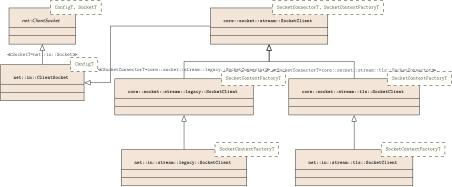

# Simple NODE in C++ (SNode.C)

[SNode.C](https://volkerchristian.github.io/snode.c-doc/html/index.html) is a very simple to use lightweight highly extendable event driven layer-based framework for network applications in the spirit of node.js written entirely in C\+\+.

The development of the  framework started during the summer semester 2020 in the context of the course **Network and Distributed Systems** of the masters program [**Interactive Media**](https://www.fh-ooe.at/en/hagenberg-campus/studiengaenge/master/interactive-media/) at the departement [**Informatics, Communications and Media**](https://www.fh-ooe.at/en/hagenberg-campus/) at the [**University of Applied Sciences Upper Austria, Campus Hagenberg**](https://www.fh-ooe.at/en/) to give students an insight into the fundamental techniques of network and web frameworks.

Main focus (but not only) of the framework is "Machine to Machine" (M2M) communication and here especially the field of "Internet of Things" (IoT).

# Table of Content
<!--ts-->
* [Simple NODE in C++ (SNode.C)](#simple-node-in-c-snodec)
* [Table of Content](#table-of-content)
* [License](#license)
* [Copyright](#copyright)
* [Quick Starting Guide](#quick-starting-guide)
   * [An "Echo" Application](#an-echo-application)
      * [SocketServer and SocketClient](#socketserver-and-socketclient)
      * [SocketContextFactories](#socketcontextfactories)
         * [Echo-Server ContextFactory](#echo-server-contextfactory)
         * [Echo-Client ContextFactory](#echo-client-contextfactory)
      * [SocketContexts](#socketcontexts)
         * [Echo-Server Context](#echo-server-context)
         * [Echo-Client Context](#echo-client-context)
      * [Main Applications for Server and Client](#main-applications-for-server-and-client)
         * [Echo-Server Main Application](#echo-server-main-application)
         * [Echo-Client Main Application](#echo-client-main-application)
   * [Summary](#summary)
* [Installation](#installation)
   * [Minimum required Compiler Versions](#minimum-required-compiler-versions)
   * [Supported Systems and Hardware](#supported-systems-and-hardware)
   * [Tools](#tools)
      * [Required](#required)
      * [Optional](#optional)
   * [Libraries](#libraries)
      * [Required](#required-1)
      * [Optional](#optional-1)
      * [In-Framework](#in-framework)
   * [Installation on Debian Style Systems (x86-64, Arm)](#installation-on-debian-style-systems-x86-64-arm)
      * [Dependencies](#dependencies)
      * [SNode.C](#snodec)
* [Design Decisions and Features](#design-decisions-and-features)
   * [Network Layer](#network-layer)
   * [Transport Layer](#transport-layer)
   * [Application Layer](#application-layer)
* [Existing Server- and Client-Classes](#existing-server--and-client-classes)
   * [SocketAddress](#socketaddress)
      * [SocketAddress Classes](#socketaddress-classes)
      * [SocketAddress Header Files](#socketaddress-header-files)
      * [SocketAddress Constructors](#socketaddress-constructors)
   * [Server](#server)
      * [SocketServer Classes](#socketserver-classes)
      * [SocketServer Header Files](#socketserver-header-files)
      * [Listen Methods](#listen-methods)
         * [Common listen() Methods](#common-listen-methods)
         * [Specific listen() Methods](#specific-listen-methods)
            * [IPv4 specific listen() Methods](#ipv4-specific-listen-methods)
            * [IPv6 specific listen() Methods](#ipv6-specific-listen-methods)
            * [Unix Domain Socket specific listen() Methods](#unix-domain-socket-specific-listen-methods)
            * [Bluetooth RFCOMM specific listen() Methods](#bluetooth-rfcomm-specific-listen-methods)
            * [Bluetooth L2CAP specific listen() Methods](#bluetooth-l2cap-specific-listen-methods)
   * [Client](#client)
      * [SocketClient Classes](#socketclient-classes)
      * [SocketClient Header Files](#socketclient-header-files)
      * [Connect Methods](#connect-methods)
         * [Common connect() Methods](#common-connect-methods)
         * [Specific connect() Methods](#specific-connect-methods)
            * [IPv4 specific connect() Methods](#ipv4-specific-connect-methods)
            * [IPv6 specific connect() Methods](#ipv6-specific-connect-methods)
            * [Unix Domain Socket specific connect() Methods](#unix-domain-socket-specific-connect-methods)
            * [Bluetooth RFCOMM specific connect() Methods](#bluetooth-rfcomm-specific-connect-methods)
            * [Bluetooth L2CAP specific connect() Methods](#bluetooth-l2cap-specific-connect-methods)
* [Configuration](#configuration)
   * [Command-Line Interface](#command-line-interface)
   * [Configuration in the Source Code](#configuration-in-the-source-code)
   * [SSL/TLS-Configuration](#ssltls-configuration)
* [Highlevel WEB-API a'la Node.JS-Express](#highlevel-web-api-ala-nodejs-express)
* [Websockets](#websockets)
* [Example Applications](#example-applications)
   * [HTTP/S Web-Server for Static HTML-Pages](#https-web-server-for-static-html-pages)
   * [Receive Data via HTTP-Post Request](#receive-data-via-http-post-request)
   * [Extract Server and Client Information (host name, IP, port, SSL/TLS information)](#extract-server-and-client-information-host-name-ip-port-ssltls-information)
   * [Using Regular Expressions in Routes](#using-regular-expressions-in-routes)

<!-- Added by: runner, at: Wed Mar  8 22:13:47 UTC 2023 -->

<!--te-->

# License

SNode.C is released under the **GNU Lesser General Public License, Version 3** ([<https://www.gnu.org/licenses/lgpl-3.0.de.html>](https://www.gnu.org/licenses/lgpl-3.0.de.html))

# Copyright

Volker Christian ([me@vchrist.at](mailto:me@vchrist.at) or [Volker.Christian@fh-hagenberg.at](mailto:volker.christian@fh-hagenberg.at))

Some components are also copyrighted by Students

-   Json Middleware

    -   Marlene Mayr

    -   Anna Moser

    -   Matteo Prock

    -   Eric Thalhammer

-   Regular-Expression Route-Mapping

    -   Joelle Helgert

    -   Julia Gruber

    -   Patrick Brandstätter

    -   Fabian Mohr

-   MariaDB Database Support

    -   Daniel Flockert

-   OAuth2 Demo System

    -   Daniel Flockert

# Quick Starting Guide

Basically the architecture of every server and client application is the same and consists of three components.

-   Server respective client instance
-   SocketContextFactory
-   SocketContext

Let\'s have a look at how these three components are related to each other by implementing a simple networking application.

## An \"Echo\" Application

Imagine we want to create a very basic TCP (**stream**)/IPv4 (**in**) server/client pair which sends some plain text data unencrypted (**legacy**) to each other in a ping-pong way.

The client shall start sending text data to the server and the server shall reflect that data back to the client. The client receives this reflected data and sends it back again to the server. This data ping-pong shall last infinitely long.

### SocketServer and SocketClient

For the server role we just need to create an object of type

``` c++
net::in::stream::legacy::SocketServer<SocketContextFactory>
```

called a *server instance* and for the client role an object of type

``` c++
net::in::stream::legacy::SocketClient<SocketContextFactory>
```

called *client instance* is needed.

Both *instance-classes* have a *default constructor* and a *constructor expecting an instance name* as argument. 

- When the default constructor is used to create the instance object this instance is called an *anonymous instance*.
- In contrast to a *named instance* if the constructors expecting a `std::string` is used for instance creation. 
- For named instances *command line arguments and configuration file entries are created automatically* to configure the instance.

A class `SocketContextFactory` is used for both instances as template argument. Such a `SocketContextFactory` is used internally by the `SocketServer` and the `SocketClient` for creating a concrete `SocketContext` object for each established connection. This `SocketContext` represents a concrete application protocol.

Thus, for our echo application we need to implement the application logic (application protocol) for server and client in classes derived from `core::socket::stream::SocketContext`, which is the base class of all connection-oriented (stream) application protocols, and factories derived from `core::socket::stream::SocketContextFactory`.

### SocketContextFactories

Let\'s focus on the SocketContextFactories for our server and client first.

All what needs to be done is to implement a pure virtual method `create()`witch expects a pointer to a `core::socket::stream::SocketConnection` as argument and returns a concrete application SocketContext.

The `core::socket::stream::SocketConnection` object involved is managed internally by SNode.C and represents the *physical connection* between the server and a client. This `core::socket::stream::SocketConnection` is used internally by the `core::socket::stream::SocketContext` to handle the physical data transfer between server and client.

#### Echo-Server ContextFactory

The `create()` method of our `EchoServerContextFactory` returns the `EchoServerContext` whose implementation is presented in the [SocketContexts](#SocketContexts) section below.

``` c++
class EchoServerContextFactory : public core::socket::stream::SocketContextFactory {
private:
    core::socket::stream::SocketContext* create(core::socket::stream::SocketConnection* socketConnection) override {
        return new EchoServerContext(socketConnection);
    }
};
```

#### Echo-Client ContextFactory

The `create()` method of our `EchoClientContextFactory` returns the `EchoClientContext` whose implementation is also presented in the [SocketContexts](#SocketContexts) section below.

``` c++
class EchoClientContextFactory : public core::socket::stream::SocketContextFactory {
private:
    core::socket::stream::SocketContext* create(core::socket::stream::SocketConnection* socketConnection) override {
        return new EchoClientContext(socketConnection);
    }  
};
```

That\'s easy, isn\'t it?

### SocketContexts

It is also not difficult to implement the SocketContext classes for the server and the client.

-   Remember, the required functionality: The server shall reflect the received data back to the client!
-   And also remember we need to derive from the base class `core::socket::stream::SocketContext`.
-   And at last remember that the class  `core::socket::stream::SocketContext` needs the `core::socket::stream::SocketConnection`  to handle the physical data exchange. Thus, we have to pass the pointer to the SocketConnection to the constructor of the base `core::socket::stream::SocketContext`  class.

The base class `core::socket::stream::SocketContext` provides *some virtual methods* which can be overridden in an concrete SocketContext class. These methods will be *called by the framework automatically*.

#### Echo-Server Context

For our echo server application it would be sufficient to override the `onReceivedFromPeer()` method only. This method is called by the framework in case some data have already been received from the client. Nevertheless, for more information of what is going on in behind the methods `onConnected` and `onDisconnected` are overridden also.

In the `onReceivedFromPeer()` method we can fetch data already received by SNode.C by using the `readFromPeer()` method provided by the `core::socket::stream::SocketContext` class.

Sending data to the client is done using the method `sendToPeer()` which is also provided by the `core::socket::stream::SocketContext` class.

``` c++
class EchoServerContext : public core::socket::stream::SocketContext {
public:
    explicit EchoServerContext(core::socket::stream::SocketConnection* socketConnection) 
        : core::socket::stream::SocketContext(socketConnection) {
    }

private: 
    void onConnected() override { // Called in case a connection has been established successfully.
        std::cout << "Echo connected to " << socketConnection->getRemoteAddress().toString() << std::endl;
    }
    
    void onDisconnected() override { // Called in case the connection has been closed.
        std::cout << "Echo disconnected from " << socketConnection->getRemoteAddress().toString() << std::endl;
    }
    
    std::size_t onReceivedFromPeer() override { // Called in case data have already been received by the framework
                                                // and thus are ready for preccessing.
        char junk[4096];

        std::size_t junkLen = readFromPeer(junk, 4096); // Fetch data.
                                                        // In case there are less than 4096 bytes available return at 
                                                        // least that amount of data.
                                                        // In case more than 4096 bytes are available 
                                                        // onReceivedFromPeer will be called again.
                                                        // No error can occure here.
        if (junkLen > 0) {
            std::cout << "Data to reflect: " << std::string(junk, junklen);
            sendToPeer(junk, junklen); // Reflect the received data back to the client.
                                       // Out of memory is the only error which can occure here.
        }

        return junkLen; // Return the amount of data processed to the framework.
    }
};
```

#### Echo-Client Context

The echo client SocketContext in contrast to the server SocketContext, *needs* an overridden `onConnected` method, to initiate the ping-pong data exchange.

Like in the `EchoServerContext` `readFromPeer()` and `sendToPeer()` is used in the `onReceivedFromPeer()` method. In addition `sendToPeer()` is also used in the `onConnected()` method to initiate the ping-pong data exchange.

``` c++
class EchoClientContext : public core::socket::stream::SocketContext {
public:
    explicit EchoClientContext(core::socket::stream::SocketConnection* socketConnection) 
        : core::socket::stream::SocketContext(socketConnection) {
    }

private:
    void onConnected() override { // Called in case a connection has been established successfully.
        std::cout << "Echo connected to " << socketConnection->getRemoteAddress().toString() << std::endl;
        
        std::cout << "Initiating data exchange" << std::endl;
        sendToPeer("Hello peer! It's nice talking to you!!!"); // Initiate the ping-pong data exchange.
    }
    
    void onDisconnected() override { // Called in case the connection has been closed.
        std::cout << "Echo disconnected from " << socketConnection->getRemoteAddress().toString() << std::endl;
    }
    
    std::size_t onReceivedFromPeer() override { // Called in case data have already been received by the framework
                                                // and thus are ready for preccessing.
        char junk[4096];

        std::size_t junkLen = readFromPeer(junk, 4096); // Fetch data.
                                                        // In case there are less than 4096 bytes available return at 
                                                        // least that amount of data.
                                                        // In case more than 4096 bytes are available 
                                                        // onReceivedFromPeer will be called again.
                                                        // No error can occure here.
        if (junkLen > 0) {
            std::cout << "Data to reflect: " << std::string(junk, junklen);
            sendToPeer(junk, junklen); // Reflect the received data back to the server.
                                       // Out of memory is the only error which can occure here.
        }

        return junkLen; // Return the amount of data processed to the framework.
    }
};
```

### Main Applications for Server and Client

Now we can put all together and implement the server and client main applications. Here *anonymous instances* are used, thus we will not get command line arguments automatically.

Note the use of our previously implemented `EchoServerContextFactory` and `EchoClientContextFactory` as template arguments.

At the very beginning SNode.C must be *initialized* by calling `core::SNodeC::init(argc, argv)`. And at the end of the main applications the *event-loop* of SNode.C is started by calling `core::SNodeC::start()`.

#### Echo-Server Main Application

The server instance `echoServer` must be *activated* by calling `echoServer.listen()`.

SNode.C provides a view overloaded `listen()` methods whose arguments vary depending on the network layer (IPv4, IPv6, RFCOM, L2CAP, or unix domain sockets) used. Though, every `listen()` method expects a lambda function as last argument. Here we use IPv4 and the `listen()` method which expects a port number as argument.

If we would have created a named server instance than a special `listen()` method which only expects the lambda function as argument can be used. In that case the configuration of this named instance would be done using command line arguments and/or a configuration file.

``` c++
int main(int argc, char* argv[]) {
    core::SNodeC::init(argc, argv); // Initialize the framework.
                                    // Configure logging, create command line arguments, daemonize if requested.
    
    using EchoServer = net::in::stream::legacy::SocketServer<EchoServerContextFactory>; // Simplify data type
                                                                                        // Note the use of our implemented
                                                                                        // EchoServerContextFactory as
                                                                                        // template argument
    using SocketAddress = EchoServer::SocketAddress; // Simplify data type
    
    EchoServer echoServer; // Create server instance
    
    echoServer.listen(8001, [](const SocketAddress& socketAddress, int err) -> void { // Listen on port 8001 on all interfaces
        if (err == 0){
            std::cout << "Success: Echo server listening on " << socketAddress.toString() << std::endl;
        } else {
            std::cout << "Error: Echo server listening on " << socketAddress.toString() << ": " << perror("") << std::endl;
        }
    });
    
    return core::SNodeC::start(); // Start the event loop.
}
```

#### Echo-Client Main Application

The client instance `echoClient` must *connect* to the server by calling `echoClient.connect()`.

Equivalent to the server instance a client instance provides a view overloaded `connect()` methods whose arguments also vary depending on the network layer used. Here it is assumed that we talk to an IPv4 server which runs on the same machine (localhost) as the client. Thus we pass the hostname "localhost" and port number 8001 to the `connect()` method.

If we would have created a named client instance than a special `connect()` method which only expects the lambda function can be used. In that case the configuration of this named instance would be done using command line arguments and/or a configuration file.

``` c++
int main(int argc, char* argv[]) {
    core::SNodeC::init(argc, argv); // Initialize the framework.
                                    // Configure logging, create command line arguments, daemonize if requested.
    
    using EchoClient = net::in::stream::legacy::SocketClient<EchoClientContextFactory>; // Simplify data type
                                                                                         // Note the use of our implemented
                                                                                         // EchoClientContextFactory as
                                                                                         // template argument
    using SocketAddress = EchoClient::SocketAddress; // Simplify data type
    
    EchoClient echoClient; // Create client instance
    
    echoClient.connect("localhost", 8001, [](const SocketAddress& socketAddress, int err) -> void { // Connect to server
        if (err == 0){
            std::cout << "Success: Echo connecting to " << socketAddress.toString() << std::endl;
        } else {
            std::cout << "Error: Echo client connecting to " << socketAddress.toString() << ": " << perror("");
        }
    });
    
    return core::SNodeC::start(); // Start the event loop.
}
```

## Summary

The echo application shows the typical architecture of servers and clients using SNode.C.

- The user needs to provide the application protocol layer by implementing the classe

  - SocketContextFactory and
  - SocketContext

  which need be be derived from the base classes

  - `core::socket::stream::SocketContextFactory`

  -   `core::socket::stream::SocketContext`

- The framework provides

  -   ready to use server and client template classes for each network/transport layer combination.

# Installation

SNode.C depends on some external libraries. Some of these libraries are directly included in the framework.

## Minimum required Compiler Versions

The only version-critical dependencies are the C++ compilers.

Either *GCC* or *clang* can be used but they need to be of a relatively up to date version because SNode.C uses some new C++20 features internally.

- GCC 10.2
- Clang 11.0

## Supported Systems and Hardware

The main development of SNode.C takes place on an Debian style linux system. Though, it should compile cleanly on every linux system provided that all required tools and libraries are installed.

SNode.C is known to compile and run successfull on

-   x86-64 architecture
    -   Tested on HP ZBook 15 G8
-   Arm architecture (32 and 64 bit)
    -   Tested on Raspberry Pi

## Tools

### Required

-   git ([<https://git-scm.com/>](https://git-scm.com/))
-   cmake ([<https://cmake.org/>](https://cmake.org/))
-   make ([<https://www.gnu.org/software/make/>](https://www.gnu.org/software/make/)) or
-   ninja ([<https://ninja-build.org/>](https://ninja-build.org/))
-   g++ ([<https://gcc.gnu.org/>](https://gcc.gnu.org/)) or
-   clang ([<https://clang.llvm.org/>](https://clang.llvm.org/))
-   pkg-config
    ([<https://www.freedesktop.org/wiki/Software/pkg-config/>](https://www.freedesktop.org/wiki/Software/pkg-config/))

### Optional

-   iwyu ([<https://include-what-you-use.org/>](https://include-what-you-use.org/))
-   clang-format ([<https://clang.llvm.org/docs/ClangFormat.html>](https://clang.llvm.org/docs/ClangFormat.html))
-   cmake-format ([<https://cmake-format.readthedocs.io/>](https://cmake-format.readthedocs.io/))
-   doxygen ([<https://www.doxygen.nl/>](https://www.doxygen.nl/))

## Libraries

### Required

-   Easylogging development files ([<https://github.com/amrayn/easyloggingpp/>](https://github.com/amrayn/easyloggingpp/))
-   OpenSSL development files ([<https://www.openssl.org/>](https://www.openssl.org/))
-   Nlohmann-JSON development files([<https://json.nlohmann.me/>](https://json.nlohmann.me/))

### Optional

-   Bluez development files ([<http://www.bluez.org/>](http://www.bluez.org/))
-   LibMagic development files ([<https://www.darwinsys.com/file/>](https://www.darwinsys.com/file/))
-   MariaDB client development files ([<https://mariadb.org/>](https://mariadb.org/))

### In-Framework

This libraries are already integrated directly in SNode.C. Thus they need not be installed by hand

-   CLI11 ([<https://github.com/CLIUtils/CLI11/>](https://github.com/CLIUtils/CLI11/))

## Installation on Debian Style Systems (x86-64, Arm)

### Dependencies

To install all dependencies on Debian style systems just run

``` sh
sudo apt update
sudo apt install git cmake make ninja-build g++ clang pkg-config
sudo apt install iwyu clang-format cmake-format doxygen
sudo apt install libeasyloggingpp-dev libssl-dev nlohmann-json3-dev
sudo apt install libbluetooth-dev libmagic-dev libmariadb-dev
```

### SNode.C

After installing all dependencies SNode.C can be cloned from github, compiled, and installed.

This is strait forward:

``` sh
mkdir snode.c
cd snode.c
git clone https://github.com/VolkerChristian/snode.c.git
mkdir build
cd build
cmake ../snode.c
make
sudo make install
```

As SNode.C uses C++ templates a lot the compilation process will take some time. At least on a Raspberry Pi you can go for a coffee - it will take up to one and a half hour (on a Raspberry Pi 3 if just one core is activated for compilation).

It is a good idea to utilize all processor cores and threads for compilation. Thus e.g. on a Raspberry Pi append `-j4` to the `make`  or `ninja` command.

# Design Decisions and Features

-   Easy to use and extend
-   Clear and clean architecture
-   Object orientated
-   Single-threaded
-   Single-tasking
-   Event driven
-   Layer based
-   Modular
-   Support for single shot and interval timer
-   Automated command line argument production and configuration file support for named server and client instances
-   Sophisticated configuration system controlled either by code, command line, or configuration file
-   Daemonize server and client if requested

## Network Layer

SNode.C currently supports five different network layer protocols.

-   Internet Protocol version 4 (IPv4)
-   Internet Protocol version 6 (IPv6)
-   Unix Domain Sockets
-   Bluetooth Radio Frequency Communication (RFCOMM)
-   Bluetooth Logical Link Control and Adaptation Protocol (L2CAP)

## Transport Layer

Currently only connection-oriented protocols (SOCK_STREAM) for all supported network layer protocols are implemented (for IPv4 and IPv6 this means TCP).

-   Every transport layer protocol provides a common base API which makes it very easy to create servers and clients for all different network layers supported.
-   New application protocols can be connected to the transport layer very easily by just implementing a SocketFactory and a SocketContext class.
-   Transparently offers SSL/TLS encryption provided by OpenSSL for each supportet transport layer protocol and thus, also for all application level protocols.
    -   Support of X.509 certificates.
    -   Server Name Indication (SNI) is supported (useful for e.g. virtual (web) servers).

## Application Layer

In-framework server and client support currently exist for the application level protocols

-   HTTP/1.1
-   WebSocket version 13
-   MQTT version 3.1.1 (version 5.0 is in preparation)
-   MQTT via WebSockets
-   High-Level Web API layer with JSON support very similar to the API of node.js/express.

As said above in the transport layer section, SSL/TLS encryption is provided for all of these application layer protocols.

# Existing Server- and Client-Classes

Before focusing explicitly on the Server- and Client-Classes a few common aspects for both and all network/transport-laClassesyer combinations needs to be known.

## SocketAddress

Every network layer provides its specific `SocketAddress` class. In typical scenarios you need not bother about these classes as they are managed internally by the framework.

Every *SocketServer* and *SocketClient* class has it's `SocketAddress` attached as data type. Thus, one can always get the correct `SocketAddress` type buy just

```cpp
using SocketAddress = <ConcreteServerOrClientType>::SocketAddress;
```

as can be seen in the Echo-Demo-Application above.

Nevertheless, for the sake of completeness, all implemented `SocketAddress` classes along with the header files they are declared in are listed below.

### SocketAddress Classes

| Network Layer       | `SocketAddress`           |
| ------------------- | ------------------------- |
| IPv4                | `net::in::SocketAddress`  |
| IPv6                | `net::in6::SocketAddress` |
| Unix Domain Sockets | `net::un::SocketAddress`  |
| Bluetooth RFCOMM    | `net::rc::SocketAddress`  |
| Bluetooth L2CAP     | `net::l2::SocketAddress`  |

### SocketAddress Header Files

| Network Layer       | `SocketAddress`           |
| ------------------- | ------------------------- |
| IPv4                | `net/in/SocketAddress.h`  |
| IPv6                | `net/in6/SocketAddress.h` |
| Unix Domain Sockets | `net/un/SocketAddress.h`  |
| Bluetooth RFCOMM    | `net/rc/SocketAddress.h`  |
| Bluetooth L2CAP     | `net/l2/SocketAddress.h`  |

Each SocketAddress class provides it's very specific set of constructors.

### SocketAddress Constructors

The default constructors of all SocketAddress classes creates wild-card SocketAddress objects. For a SocketClient for exampe, which uses such a wild-card SocketAddress as *local address* the operating system chooses a valid `sockaddr` structure automatically.

| SocketAddress |      Constructors |
| ------------------- | ------------------------- |
| `net::in::SocketAddress` | `SocketAddress()`<br/>`SocketAddress(const std::string& ipOrHostname)`<br/>`SocketAddress(const std::string& ipOrHostname, uint16_t port)`<br/>`SocketAddress(uint16_t port)` |
| `net::in6::SocketAddress` | `SocketAddress()`<br/>`SocketAddress(const std::string& ipOrHostname)`<br/>`SocketAddress(const std::string& ipOrHostname, uint16_t port)`<br/>`SocketAddress(uint16_t port)` |
| `net::un::SocketAddress` | `SocketAddress()`<br/>`SocketAddress(const std::string& sunPath)` |
| `net::rc::SocketAddress` | `SocketAddress()`<br/>`SocketAddress(const std::string& btAddress)`<br/>`SocketAddress(const std::string& btAddress, uint8_t channel)`<br/>`SocketAddress(uint8_t channel)` |
| `net::l2::SocketAddress` | `SocketAddress()`<br/>`SocketAddress(const std::string& btAddress)`<br/>`SocketAddress(const std::string& btAddress, uint16_t psm)`<br/>`SocketAddress(uint16_t psm)` |


## Server

### SocketServer Classes

| Network Layer       | Legacy Connection                        | SSL/TLS Connection                    |
| ------------------- | ---------------------------------------- | ------------------------------------- |
| IPv4                | `net::in::stream::legacy::SocketServer`  | `net::in::stream::tls::SocketServer`  |
| IPv6                | `net::in6::stream::legacy::SocketServer` | `net::in6::stream::tls::SocketServer` |
| Unix Domain Sockets | `net::un::stream::legacy::SocketServer`  | `net::un::stream::tls::SocketServer`  |
| Bluetooth RFCOMM    | `net::rc::stream::legacy::SocketServer`  | `net::rc::stream::tls::SocketServer`  |
| Bluetooth L2CAP     | `net::l2::stream::legacy::SocketServer`  | `net::l2::stream::tls::SocketServer`  |

### SocketServer Header Files


| Network Layer       | Legacy Connection                      | SSL/TLS Connection                  |
| ------------------- | -------------------------------------- | ----------------------------------- |
| IPv4                | `net/in/stream/legacy/SocketServer.h`  | `net/in/stream/tls/SocketServer.h`  |
| IPv6                | `net/in6/stream/legacy/SocketServer.h` | `net/in6/stream/tls/SocketServer.h` |
| Unix Domain Sockets | `net/un/stream/legacy/SocketServer.h`  | `net/un/stream/tls/SocketServer.h`  |
| Bluetooth RFCOMM    | `net/rc/stream/legacy/SocketServer.h`  | `net/rc/stream/tls/SocketServer.h`  |
| Bluetooth L2CAP     | `net/l2/stream/legacy/SocketServer.h`  | `net/l2/stream/tls/SocketServer.h`  |

### Listen Methods

As already mentioned above, each `SocketServer` class provides its own specific set of `listen()` methods. But some `listen()` methods are common to all `SocketServer` classes.

#### Common `listen()` Methods

The type `StatusFunction` is defined as

```cpp
using StatusFunction = const std::function<void(const <ConcreteServerOrClientType>::SocketAddress&, int)>;
```

| `listen()`Method Type                          | `listen()` Methods common to all SocketServer Classes        |
| ---------------------------------------------- | ------------------------------------------------------------ |
| Listen without parameter[¹]                    | `void listen(StatusFunction& onError)`                       |
| Listen expecting a `SocketAddress` as argument | `void listen(const SocketAddress& localAddress, int backlog, StatusFunction& onError)` |

[^1]: "Without parameter" is not completely right because every listen() method expects a std::function for status processing (error or success) as argument. 

#### Specific `listen()` Methods

##### IPv4 specific `listen()` Methods

The type `StatusFunction` is defined as

```cpp
using StatusFunction = const std::function<void(const net::in::SocketAddress&, int)>;
```

For the IPv4/SOCK_STREAM combination exist three specific `listen()` methods.

| `listen()` Methods                                           |
| ------------------------------------------------------------ |
| `void listen(uint16_t port, int backlog, StatusFunction& onError)` |
| `void listen(const std::string& ipOrHostname, int backlog, StatusFunction& onError)` |
| `void listen(const std::string& ipOrHostname, uint16_t port, int backlog, StatusFunction& onError)` |

##### IPv6 specific `listen()` Methods

The type `StatusFunction` is defined as

```cpp
using StatusFunction = const std::function<void(const net::in6::SocketAddress&, int)>;
```

For the IPv6/SOCK_STREAM combination exist three specific `listen()` methods.

| `listen()` Methods                                           |
| ------------------------------------------------------------ |
| `void listen(uint16_t port, int backlog, StatusFunction& onError)` |
| `void listen(const std::string& ipOrHostname, int backlog, StatusFunction& onError)` |
| `void listen(const std::string& ipOrHostname, uint16_t port, int backlog, StatusFunction& onError)` |

##### Unix Domain Socket specific `listen()` Methods

The type `StatusFunction` is defined as

```cpp
using StatusFunction = const std::function<void(const net::un::SocketAddress&, int)>;
```

For the Unix Domain Socket/SOCK_STREAM combination exist one specific `listen()` methods.

| `listen()` Methods                                           |
| ------------------------------------------------------------ |
| `void listen(const std::string& sunPath, int backlog, StatusFunction& onError)` |

##### Bluetooth RFCOMM specific `listen()` Methods

IPv4 The type `StatusFunction` is defined as

```cpp
using StatusFunction = const std::function<void(const net::rc::SocketAddress&, int)>;
```

For the RFCOMM/SOCK_STREAM combination exist three specific `listen()` methods.

| `listen()` Methods                                           |
| ------------------------------------------------------------ |
| `void listen(uint8_t channel, int backlog, StatusFunction& onError)` |
| `void listen(const std::string& btAddress, int backlog, StatusFunction& onError)` |
| `void listen(const std::string& btAddress, uint8_t channel, int backlog, StatusFunction& onError)` |

##### Bluetooth L2CAP specific `listen()` Methods

IPv4 The type `StatusFunction` is defined as

```cpp
using StatusFunction = const std::function<void(const net::l2::SocketAddress&, int)>;
```

For the L2CAP/SOCK_STREAM combination exist three specific `listen()` methods.

| `listen()` Methods                                           |
| ------------------------------------------------------------ |
| `void listen(uint16_t psm, int backlog, StatusFunction& onError)` |
| `void listen(const std::string& btAddress, int backlog, StatusFunction& onError)` |
| `void listen(const std::string& btAddress, uint16_t psm, int backlog, StatusFunction& onError)` |

## Client

### SocketClient Classes


| Network Layer       | Legacy Connection                        | SSL/TLS Connection                    |
| ------------------- | ---------------------------------------- | ------------------------------------- |
| IPv4                | `net::in::stream::legacy::SocketClient`  | `net::in::stream::tls::SocketClient`  |
| IPv6                | `net::in6::stream::legacy::SocketClient` | `net::in6::stream::tls::SocketClient` |
| Unix Domain Sockets | `net::un::stream::legacy::SocketClient`  | `net::un::stream::tls::SocketClient`  |
| Bluetooth RFCOMM    | `net::rc::stream::legacy::SocketClient`  | `net::rc::stream::tls::SocketClient`  |
| Bluetooth L2CAP     | `net::l2::stream::legacy::SocketClient`  | `net::l2::stream::tls::SocketClient`  |

### SocketClient Header Files


| Network Layer       | Legacy Connection                      | SSL/TLS Connection                  |
| ------------------- | -------------------------------------- | ----------------------------------- |
| IPv4                | `net/in/stream/legacy/SocketClient.h`  | `net/in/stream/tls/SocketClient.h`  |
| IPv6                | `net/in6/stream/legacy/SocketClient.h` | `net/in6/stream/tls/SocketClient.h` |
| Unix Domain Sockets | `net/un/stream/legacy/SocketClient.h`  | `net/un/stream/tls/SocketClient.h`  |
| Bluetooth RFCOMM    | `net/rc/stream/legacy/SocketClient.h`  | `net/rc/stream/tls/SocketClient.h`  |
| Bluetooth L2CAP     | `net/l2/stream/legacy/SocketClient.h`  | `net/l2/stream/tls/SocketClient.h`  |

### Connect Methods

As already mentioned above, each `SocketClient` class provides its own specific set of `connect()` methods. But some `connect()` methods are common to all `SocketClient` classes.

#### Common `connect()` Methods

The type `StatusFunction` is defined as

```cpp
using StatusFunction = const std::function<void(const <ConcreteServerOrClientType>::SocketAddress&, int)>;
```

| `connect()`Method Type                             | `connect()` Methods common to all SocketServer Classes       |
| -------------------------------------------------- | ------------------------------------------------------------ |
| Connect without parameter[¹]                       | `void connect(StatusFunction& onError)`                      |
| Connect expecting a `SocketAddress` as argument    | `void connect(const SocketAddress& remoteAddress, StatusFunction& onError)` |
| Connect expecting two `SocketAddress`s as argument | `void connect(const SocketAddress& remoteAddress, const SocketAddress& localAddress, StatusFunction& onError)` |

[^1]: "Without parameter" is not completely right because every listen() method expects a std::function for status processing (error or success) as argument. 

#### Specific connect() Methods

##### IPv4 specific `connect()` Methods

The type `StatusFunction` is defined as

```cpp
using StatusFunction = const std::function<void(const net::in::SocketAddress&, int)>;
```

For the IPv4/SOCK_STREAM combination exist three specific `connect()` methods.

| `connect()` Methods                                          |
| ------------------------------------------------------------ |
| `void connect(const std::string& ipOrHostname, uint16_t port, StatusFunction& onError)` |
| `void connect(const std::string& ipOrHostname, uint16_t port, const std::string& bindIpOrHostname, StatusFunction& onError)` |
| `void connect(const std::string& ipOrHostname, uint16_t port, const std::string& bindIpOrHostname, uint16_t bindPort, StatusFunction& onError)` |

##### IPv6 specific `connect()` Methods

The type `StatusFunction` is defined as

```cpp
using StatusFunction = const std::function<void(const net::in6::SocketAddress&, int)>;
```

For the IPv6/SOCK_STREAM combination exist three specific `connect()` methods.

| `connect()` Methods                                          |
| ------------------------------------------------------------ |
| `void connect(const std::string& ipOrHostname, uint16_t port, StatusFunction& onError)` |
| `void connect(const std::string& ipOrHostname, uint16_t port, const std::string& bindIpOrHostname, StatusFunction& onError)` |
| `void connect(const std::string& ipOrHostname, uint16_t port, const std::string& bindIpOrHostname, uint16_t bindPort, StatusFunction& onError)` |

##### Unix Domain Socket specific `connect()` Methods

The type `StatusFunction` is defined as

```cpp
using StatusFunction = const std::function<void(const net::un::SocketAddress&, int)>;
```

For the Unix Domain Socket/SOCK_STREAM combination exist two specific `connect()` methods.

| `connect()` Methods                                          |
| ------------------------------------------------------------ |
| `void connect(const std::string& sunPath, StatusFunction& onError)` |
| `void connect(const std::string& remoteSunPath, const std::string& localSunPath, StatusFunction& onError)` |

##### Bluetooth RFCOMM specific `connect()` Methods

IPv4 The type `StatusFunction` is defined as

```cpp
using StatusFunction = const std::function<void(const net::rc::SocketAddress&, int)>;
```

For the RFCOMM/SOCK_STREAM combination exist three specific `connect()` methods.

| `connect()` Methods                                          |
| ------------------------------------------------------------ |
| `void connect(const std::string& address, uint8_t channel, StatusFunction& onError)` |
| `void connect(const std::string& address, uint8_t channel, StatusFunction& onError)` |
| `void connect(const std::string& address, uint8_t channel, const std::string& localAddress, uint8_t bindChannel, StatusFunction& onError)` |

##### Bluetooth L2CAP specific `connect()` Methods

IPv4 The type `StatusFunction` is defined as

```cpp
using StatusFunction = const std::function<void(const net::l2::SocketAddress&, int)>;
```

For the L2CAP/SOCK_STREAM combination exist three specific `connect()` methods.

| `connect()` Methods                                          |
| ------------------------------------------------------------ |
| `void connect(const std::string& address, uint16_t psm, StatusFunction& onError)` |
| `void connect(const std::string& address, uint16_t psm, const std::string& localAddress, StatusFunction& onError)` |
| `void connect(const std::string& address, uint16_t psm, const std::string& localAddress, uint16_t bindPsm, StatusFunction& onError)` |

# Configuration

To be written

## Command-Line Interface

To be written

## Configuration in the Source Code

To be written

## SSL/TLS-Configuration

To be written

# Highlevel WEB-API a'la Node.JS-Express

To be written

# Websockets

To be written

# Example Applications

## HTTP/S Web-Server for Static HTML-Pages

This application uses the high-level web API *express* which is very similar to the API of node.js/express. The `StaticMiddleware` is used to deliver the static HTML-pages.

The use of X.509 certificates for encrypted communication is demonstrated also.

``` cpp
#include <express/legacy/in/WebApp.h>
#include <express/tls/in/WebApp.h>
#include <express/middleware/StaticMiddleware.h>
#include <log/Logger.h>
#include <utils/Config.h>

int main(int argc, char* argv[]) {
    utils::Config::add_string_option("--web-root", "Root directory of the web site", "[path]");

    express::WebApp::init(argc, argv);
    
    using LegacyWebApp = express::legacy::in::WebApp;
    using LegacySocketAddress = LegacyWebApp::SocketAddress;

    LegacyWebApp legacyApp;
    legacyApp.getConfig().setReuseAddress();

    legacyApp.use(express::middleware::StaticMiddleware(utils::Config::get_string_option_value("--web-root")));

    legacyApp.listen(8080, [](const LegacySocketAddress& socketAddress, int errnum) {
        if (errnum < 0) {
            PLOG(ERROR) << "OnError";
        } else if (errnum > 0) {
            PLOG(ERROR) << "OnError: " << socketAddress.toString();
        } else {
            VLOG(0) << "snode.c listening on " << socketAddress.toString();
        }
    });

    using TLSWebApp = express::tls::in::WebApp;
    using TLSSocketAddress = TLSWebApp::SocketAddress;

    TLSWebApp tlsApp;
    tlsApp.getConfig().setReuseAddress();

    tlsApp.getConfig().setCertChain("<path to X.509 certificate chain>");
    tlsApp.getConfig().setCertKey("<path to X.509 certificate key>");
    tlsApp.getConfig().setCertKeyPassword("<certificate key password>");

    tlsApp.use(express::middleware::StaticMiddleware(utils::Config::get_string_option_value("--web-root")));

    tlsApp.listen(8088, [](const TLSSocketAddress& socketAddress, int errnum) {
        if (errnum < 0) {
            PLOG(ERROR) << "OnError";
        } else if (errnum > 0) {
            PLOG(ERROR) << "OnError: " << socketAddress.toString();
        } else {
            VLOG(0) << "snode.c listening on " << socketAddress.toString();
        }
    });

    return express::WebApp::start();
}
```

## Receive Data via HTTP-Post Request

The high-level web API provides the methods `get()`, `post()`, `put()`, etc like node.js/express.

``` cpp
#include <express/legacy/in/WebApp.h>
#include <express/tls/in/WebApp.h>
#include <log/Logger.h>

int main(int argc, char* argv[]) {
    express::WebApp::init(argc, argv);

    using LegacyWebApp = express::legacy::in::WebApp;
    using LegacySocketAddress = LegacyWebApp::SocketAddress;

    LegacyWebApp legacyApp;
    legacyApp.getConfig().setReuseAddress();

    // The macro 
    //    APPLICATION(req, res)
    // expands to 
    //    ([[maybe_unused]] express::Request& (req), [[maybe_unused]] express::Response& (res)
    legacyApp.get("/", [] APPLICATION(req, res) {
        res.send("<html>"
                 "    <head>"
                 "        <style>"
                 "            main {"
                 "                min-height: 30em;"
                 "                padding: 3em;"
                 "                background-image: repeating-radial-gradient( circle at 0 0, #fff, #ddd 50px);"
                 "            }"
                 "            input[type=\"file\"] {"
                 "                display: block;"
                 "                margin: 2em;"
                 "                padding: 2em;"
                 "                border: 1px dotted;"
                 "            }"
                 "        </style>"
                 "    </head>"
                 "    <body>"
                 "        <h1>File-Upload with input type=\"file\"</h1>"
                 "        <main>"
                 "            <h2>Send us something fancy!</h2>"
                 "            <form method=\"post\" enctype=\"multipart/form-data\">"
                 "                <label> Select a text file (*.txt, *.html etc.) from your computer."
                 "                    <input name=\"datei\" type=\"file\" size=\"50\" accept=\"text/*\">"
                 "                </label>"
                 "                <button>… and off we go!</button>"
                 "            </form>"
                 "        </main>"
                 "    </body>"
                 "</html>");
    });

    legacyApp.post("/", [] APPLICATION(req, res) {
        req.body.push_back(0);

        res.send("<html>"
                 "    <body>"
                 "        <h1>Thank you, we received your file!</h1>"
                 "        <h2>Content:</h2>"
                 "<pre>" +
                 std::string(reinterpret_cast<char*>(req.body.data())) +
                 "</pre>"
                 "    </body>"
                 "</html>");
    });

    legacyApp.listen(8080, [](const LegacySocketAddress& socketAddress, int errnum) -> void {
        if (errnum != 0) {
            PLOG(ERROR) << "OnError: " << socketAddress.toString();
        } else {
            VLOG(0) << "LegacyWebApp listening on " << socketAddress.toString();
        }
    });

    using TLSWebApp = express::tls::in::WebApp;
    using TLSSocketAddress = TLSWebApp::SocketAddress;

    TLSWebApp tlsApp;
    
    tlsApp.getConfig().setReuseAddress();

    tlsApp.getConfig().setCertChain("<path to X.509 certificate chain>");
    tlsApp.getConfig().setCertKey("<path to X.509 certificate key>");
    tlsApp.getConfig().setCertKeyPassword("<certificate key password>");

    tlsApp.use(legacyApp);

    tlsApp.listen(8088, [](const TLSSocketAddress& socketAddress, int errnum) -> void {
        if (errnum != 0) {
            PLOG(ERROR) << "OnError: " << socketAddress.toString();
        } else {
            VLOG(0) << "TLSWebApp listening on " << socketAddress.toString();
        }
    });

    return express::WebApp::start();
}
```

## Extract Server and Client Information (host name, IP, port, SSL/TLS information)

``` cpp
To be documented soon
```

## Using Regular Expressions in Routes

``` cpp
To be documented soon
```


<!-- <p align="center">
</p> -->

