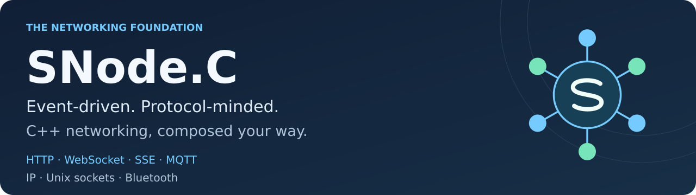
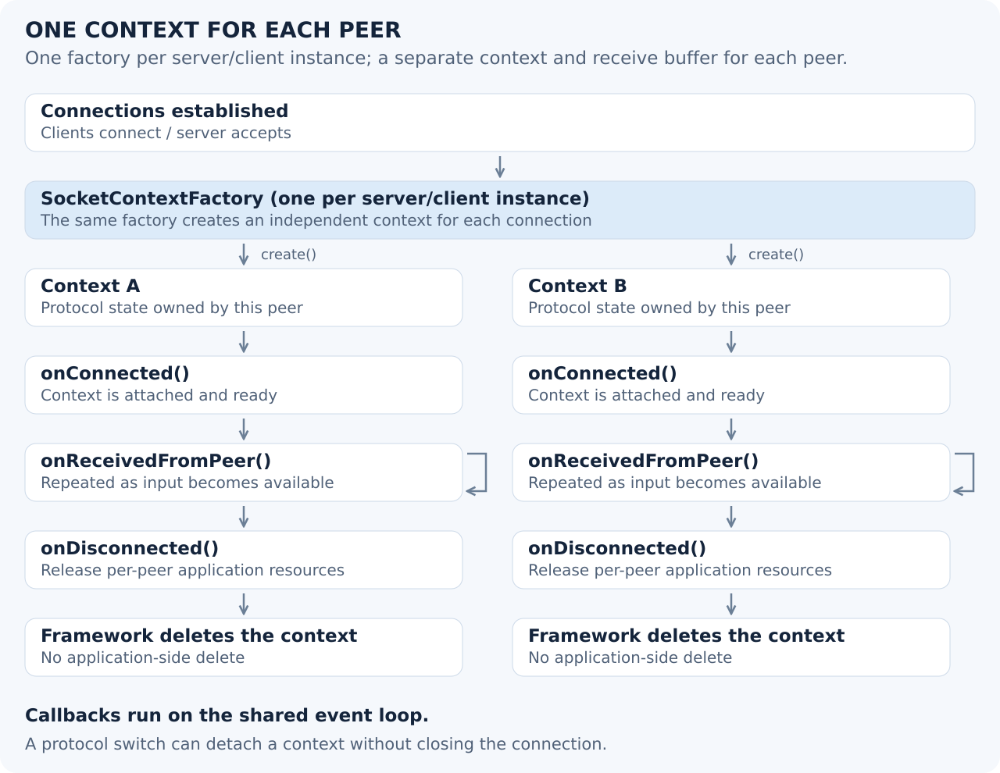
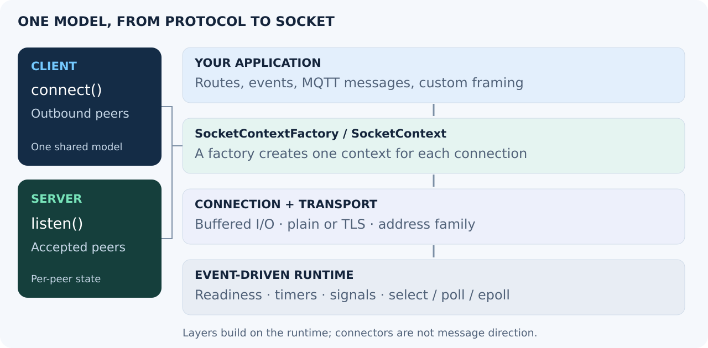

<a name="project-overview"></a>

<picture>
  <source media="(max-width: 600px)" srcset="docs/readme/media/hero-mobile.svg">
  
</picture>

# SNode.C

**Write the protocol. Choose the connection. Build the application.**

**[Get prebuilt packages](https://github.com/SNodeC/Packages#readme)** — Signed packages and installation instructions for OpenWrt, Raspberry Pi OS, Debian, Ubuntu, Rocky Linux and Fedora.

SNode.C—Simple Node in C++—is an event-driven C++20 networking framework for Linux. Its starting point is a **factory that creates a protocol context for each connection**. Write your protocol once, then use it with clients and servers over IP, Unix-domain sockets or Bluetooth.

The example below makes that model concrete. Ready-made HTTP, WebSocket, Server-Sent Events and MQTT components build on the same foundation, and multiple named clients and servers can share one event loop and configuration system.

**Projects using SNode.C:**

- [MQTTSuite](https://github.com/SNodeC/mqttsuite#project-overview)
- [AISuite](https://github.com/SNodeC/AISuite#project-overview)
- [CodexUI](https://github.com/SNodeC/CodexUI#project-overview)

<p>
  <a href="docs/readme/install.md" title="Build from source"></a>
  <a href="#your-first-program-a-factory-and-a-context" title="Start coding"></a>
  <a href="docs/readme/examples.md" title="Examples"></a>
  <a href="docs/readme/capabilities.md" title="Capabilities"></a>
  <a href="docs/readme/deployment.md" title="Deployment"></a>
  <a href="https://snodec.github.io/snode.c-doc/html/index.html" title="API reference"></a>
</p>

## Your first program: a factory and a context

This native server and client share one `EchoContext` implementation. The `Role` selects its behavior: the server reflects received bytes; the client sends one line, prints the reply and closes. Each connection gets its own context and receive state.

**You need:** installed SNode.C development libraries with the `net-in-stream-legacy` component (included in the `snodec` DEB/RPM package), a C++20 compiler, CMake 3.18+, and a free loopback port **18001**. Python 3 is needed only for the additional interoperability check. Create an empty example directory.

**Code — `echo.h`, shared by both executables:**

```cpp
#pragma once
#include <core/socket/stream/SocketContext.h>
#include <core/socket/stream/SocketContextFactory.h>
#include <cstddef>
#include <iostream>
#include <string>

enum class Role { SERVER, CLIENT };

class EchoContext final : public core::socket::stream::SocketContext {
public:
    EchoContext(core::socket::stream::SocketConnection* connection, Role role)
        : SocketContext(connection), role(role) {}

private:
    void onConnected() override {
        if (role == Role::CLIENT) sendToPeer(std::string("Hello, context!\n"));
    }
    void onDisconnected() override {}
    bool onSignal(int) override { return true; }

    std::size_t onReceivedFromPeer() override {
        char bytes[4096];
        const std::size_t count = readFromPeer(bytes, sizeof(bytes));
        if (role == Role::SERVER) {
            if (count != 0) sendToPeer(bytes, count);
        } else {
            for (std::size_t i = 0; i < count; ++i) {
                if (reply.size() == 4096) {
                    close();
                    return count;
                }
                reply += bytes[i];
                if (bytes[i] == '\n') {
                    std::cout << reply << std::flush;
                    close();
                    return count;
                }
            }
        }
        return count;
    }

    Role role;
    std::string reply;
};

template <Role role>
class EchoFactory final : public core::socket::stream::SocketContextFactory {
private:
    core::socket::stream::SocketContext*
    create(core::socket::stream::SocketConnection* connection) override {
        return new EchoContext(connection, role);
    }
};
```

**Code — `echo-server.cpp`:**

```cpp
#include "echo.h"
#include <core/SNodeC.h>
#include <core/socket/State.h>
#include <net/in/stream/legacy/SocketServer.h>

int main(int argc, char* argv[]) {
    core::SNodeC::init(argc, argv);
    using Server = net::in::stream::legacy::SocketServer<EchoFactory<Role::SERVER>>;
    const Server server("echo");
    server.listen("127.0.0.1", 18001,
                  [](const Server::SocketAddress& address, core::socket::State state) {
        if (state == core::socket::State::OK)
            std::cout << "Listening on " << address.toString() << std::endl;
        else
            std::cerr << state.what() << '\n';
    });
    return core::SNodeC::start();
}
```

**Code — `echo-client.cpp`:**

```cpp
#include "echo.h"
#include <core/SNodeC.h>
#include <core/socket/State.h>
#include <net/in/stream/legacy/SocketClient.h>

int main(int argc, char* argv[]) {
    core::SNodeC::init(argc, argv);
    using Client = net::in::stream::legacy::SocketClient<EchoFactory<Role::CLIENT>>;
    const Client client("request");
    client.connect("127.0.0.1", 18001,
                   [](const Client::SocketAddress&, core::socket::State state) {
        if (state != core::socket::State::OK) std::cerr << state.what() << '\n';
    });
    return core::SNodeC::start();
}
```

**Build — `CMakeLists.txt`:**

```cmake
cmake_minimum_required(VERSION 3.18)
project(snodec_echo LANGUAGES CXX)
find_package(snodec REQUIRED COMPONENTS net-in-stream-legacy)
add_executable(echo-server echo-server.cpp)
add_executable(echo-client echo-client.cpp)
foreach(target echo-server echo-client)
    target_compile_features(${target} PRIVATE cxx_std_20)
    target_link_libraries(${target} PRIVATE snodec::net-in-stream-legacy)
endforeach()
```

**Run — terminal 1:**

```text
cmake -S . -B build -DCMAKE_BUILD_TYPE=Release
cmake --build build --parallel
./build/echo-server --config-file /dev/null
```

**Run — terminal 2:**

```text
./build/echo-client --config-file /dev/null request socket --reconnect=false
```

**Interoperability check with Python — terminal 2:**

```text
python3 - <<'PY'
import socket
with socket.create_connection(('127.0.0.1', 18001)) as peer:
    peer.sendall(b'Hello, context!\n')
    with peer.makefile('rb') as reply:
        print(reply.readline().decode(), end='')
PY
```

**Expected result:** both the native client and the Python check print `Hello, context!` once. The native client closes its connection and exits after the reply; framework lifecycle logs may also appear. Stop the server with Ctrl+C.

**Boundaries:** this is a byte-stream echo, without authentication or encryption. A read can contain part of a message or several messages; a real protocol must implement framing. The client accepts one LF-terminated reply of at most 4096 bytes; an overlong reply closes the connection. It never echoes the reply back. `legacy` means **plain/unencrypted**, not deprecated. `--config-file /dev/null` avoids loading a saved configuration; explicit `--reconnect=false` keeps this example one-shot even with a different build-time default.

**Go further:** [line framing](docs/readme/examples.md#a-line-oriented-protocol).

### What happens to a connection

- The server accepts a peer; the factory creates its context. Clients use the same factory/context model after connecting.
- The framework calls `onConnected()`, then dispatches receive callbacks. `onReceivedFromPeer()` returns the number of bytes consumed; writes are buffered by `sendToPeer()`.
- Per-peer state belongs in the context, not in a shared application-wide protocol object.
- On detachment, the framework calls `onDisconnected()` and deletes the context. Do not delete it yourself or retain a raw pointer after detachment. A protocol upgrade can detach a context without closing the underlying connection.
- Callbacks run on the event loop; keep them non-blocking. The returned listen/connect control handle is optional to retain—the operation continues without it.

<picture>
  <source media="(max-width: 600px)" srcset="docs/readme/media/context-lifecycle-mobile.svg">
  
</picture>

The strings `"echo"` and `"request"` name the server's and client's **configuration instances**. For example, `./build/echo-server --config-file /dev/null echo local --port 18002` selects the server instance's local endpoint; `./build/echo-server --config-file /dev/null echo --help=expanded` lists its options. The executable name and instance name are separate concepts.

### Same context, another transport

The factory is independent of the socket address and encryption layer. These are the corresponding header/type pairs:

```text
IPv4 TLS — component: net-in-stream-tls
  <net/in/stream/tls/SocketServer.h>
  net::in::stream::tls::SocketServer<EchoFactory<Role::SERVER>>

Unix socket — component: net-un-stream-legacy
  <net/un/stream/legacy/SocketServer.h>
  net::un::stream::legacy::SocketServer<EchoFactory<Role::SERVER>>
```

A Unix listener takes a socket path instead of a host/port. TLS also requires certificates, private keys and peer-trust configuration; see [deployment](docs/readme/deployment.md).

## A small web service

HTTP uses a ready-made context factory. The Express-style `WebApp` adds routes on top, so application code can work with requests and responses instead of parsing bytes. This service offers a greeting and a small SSE endpoint used in the next example.

**You need:** the `http-server-express-legacy-in` development component, C++20, CMake, curl, and free loopback port **18081**. Use a new directory separate from the echo example.

**Code — `main.cpp`:**

```cpp
#include <express/legacy/in/WebApp.h>
#include <core/socket/State.h>
#include <iostream>
#include <memory>

int main(int argc, char* argv[]) {
    using WebApp = express::legacy::in::WebApp;
    WebApp::init(argc, argv);

    const WebApp app("hello");
    app.get("/hello", [](const std::shared_ptr<WebApp::Request>&,
                         const std::shared_ptr<WebApp::Response>& res) {
        res->send("Hello from SNode.C!\n");
    });
    app.get("/events", [](const std::shared_ptr<WebApp::Request>&,
                          const std::shared_ptr<WebApp::Response>& res) {
        res->set("Content-Type", "text/event-stream")
           .set("Cache-Control", "no-cache")
           .sendHeader();
        res->sendFragment("event: measurement\nid: 1\n"
                          "data: {\"sensor\":\"temperature\",\"value\":23.5}\n\n");
    });

    app.listen("127.0.0.1", 18081,
               [](const WebApp::SocketAddress& address,
                  const core::socket::State& state) {
        if (state == core::socket::State::OK)
            std::cout << "Listening on " << address.toString() << '\n';
        else
            std::cerr << state.what() << '\n';
    });

    return WebApp::start();
}
```

**Build — `CMakeLists.txt`:**

```cmake
cmake_minimum_required(VERSION 3.18)
project(snodec_hello LANGUAGES CXX)
find_package(snodec REQUIRED COMPONENTS http-server-express-legacy-in)
add_executable(hello main.cpp)
target_compile_features(hello PRIVATE cxx_std_20)
target_link_libraries(hello PRIVATE snodec::http-server-express-legacy-in)
```

**Run — terminal 1:**

```text
cmake -S . -B build -DCMAKE_BUILD_TYPE=Release
cmake --build build --parallel
./build/hello --config-file /dev/null
```

**Run — terminal 2:**

```text
curl http://127.0.0.1:18081/hello
```

**Expected result:** `Hello from SNode.C!` followed by a newline. Leave the server running for the SSE example, or stop it with Ctrl+C.

**Boundaries:** loopback HTTP, without TLS or authentication. For HTTPS use `<express/tls/in/WebApp.h>`, `express::tls::in::WebApp` and component `http-server-express-tls-in`, then configure certificates and trust.

**Go further:** [deployment and resource limits](docs/readme/deployment.md).

## One programming model, several ways to connect

<picture>
  <source media="(max-width: 600px)" srcset="docs/readme/media/architecture-mobile.svg">
  
</picture>

*A factory creates a protocol context for each connection. Clients and servers reuse that model; changing the transport does not require a second application architecture.*

- **HTTP / HTTPS:** client and server APIs, streaming bodies, request/response handling and protocol upgrade.
- **Express-style web API:** routing, middleware, static files, JSON bodies, virtual hosts and HTTP Basic authentication.
- **WebSockets:** client/server roles, HTTP upgrade and application subprotocols, including MQTT adapters.
- **Server-Sent Events:** server streams and a native `EventSource` client with named listeners and reconnect handling.
- **MQTT 3.1.1:** client/server building blocks, broker functionality and WebSocket adapters. For ready-to-run applications, use [MQTTSuite](https://github.com/SNodeC/mqttsuite#project-overview).
- **Custom protocols:** `SocketContext` and `SocketContextFactory` provide per-connection framing, messages and behavior.
- **MariaDB:** event-driven database integration for queries and persistence.

### Connection variants

| Family | Namespace | Endpoint |
| --- | --- | --- |
| IPv4 | `net::in` | Host + port |
| IPv6 | `net::in6` | Host + port |
| Unix domain | `net::un` | Socket path |
| RFCOMM | `net::rc` | Bluetooth address + channel |
| L2CAP | `net::l2` | Bluetooth address + PSM |

All families offer plain (`stream::legacy`) and TLS (`stream::tls`) connections within the listed namespace.

Bluetooth components require BlueZ and suitable hardware. Higher-level wrappers cover the families listed in the [capability guide](docs/readme/capabilities.md). Unix datagram sockets are a separate lower-level facility; the table describes stream transports.

[Explore the full capability map →](docs/readme/capabilities.md)

## Receive a server-sent event

SSE delivers named events over HTTP without a WebSocket connection. This native client consumes the `/events` route shown above and closes after the first measurement.

**You need:** the running HTTP example, the `http-client` and `net-in-stream-legacy` development components, C++20 and CMake. Create another empty directory.

**Code — `main.cpp`:**

```cpp
#include <core/SNodeC.h>
#include <net/in/SocketAddress.h>
#include <web/http/legacy/in/EventSource.h>
#include <iostream>

int main(int argc, char* argv[]) {
    core::SNodeC::init(argc, argv);
    auto events = web::http::legacy::in::EventSource(
        "http", net::in::SocketAddress{"127.0.0.1", 18081}, "/events");
    events->addEventListener("measurement", [&events](const auto& event) {
        std::cout << event.data << std::endl;
        events->close();
    });
    events->onError([] { std::cerr << "SSE connection error\n"; });
    return core::SNodeC::start();
}
```

**Build — `CMakeLists.txt`:**

```cmake
cmake_minimum_required(VERSION 3.18)
project(snodec_events LANGUAGES CXX)
find_package(snodec REQUIRED COMPONENTS http-client net-in-stream-legacy)
add_executable(events main.cpp)
target_compile_features(events PRIVATE cxx_std_20)
target_link_libraries(events PRIVATE snodec::http-client snodec::net-in-stream-legacy)
```

**Run — terminal 2:**

```text
cmake -S . -B build -DCMAKE_BUILD_TYPE=Release
cmake --build build --parallel
./build/events --config-file /dev/null
```

**Expected result:** `{"sensor":"temperature","value":23.5}`. You can also inspect the wire format with `curl -N http://127.0.0.1:18081/events`.

**Boundaries:** the server sends one event and leaves the response open; the native client closes after receiving it. Stop curl with Ctrl+C. A continuous feed sends further fragments and removes subscriber callbacks on disconnect. SSE records use newline separators and a blank line after each event; HTTP chunk boundaries are not SSE record boundaries. The first `EventSource` argument is the URL scheme (`"http"`), not an instance name. Reconnection and `Last-Event-ID` support do not supply application-level durable replay.

**Go further:** [SSE and WebSocket capabilities](docs/readme/capabilities.md#server-sent-events).

## Talk both ways with a WebSocket

HTTP serves a small page, then upgrades `/ws` to a bidirectional WebSocket connection. The installed `echo` subprotocol supplies the message handling; the route handles HTTP upgrade rather than implementing another frame parser.

**You need:** the `http-server-express-legacy-in` development component, the framework's installed HTTP/WebSocket upgrade and **server-side echo subprotocol plugins** (package `snodec-apps`, included in `snodec`), C++20, CMake and a browser. Port **18082** must be free. Keep plugins and libraries from the same installation.

**Code — `main.cpp`:**

```cpp
#include <core/socket/State.h>
#include <express/legacy/in/WebApp.h>
#include <iostream>
#include <memory>
#include <string>

int main(int argc, char* argv[]) {
    using WebApp = express::legacy::in::WebApp;
    WebApp::init(argc, argv);
    const WebApp app("websocket");
    app.get("/", [](const std::shared_ptr<WebApp::Request>&,
                    const std::shared_ptr<WebApp::Response>& res) {
        res->set("Content-Type", "text/html; charset=utf-8").send(R"HTML(
<!doctype html>
<html lang="en"><meta charset="utf-8"><title>SNode.C WebSocket echo</title>
<h1>WebSocket echo</h1><pre id="output">Connecting...</pre>
<script>
const output = document.getElementById('output');
const peer = new WebSocket('ws://' + location.host + '/ws', 'echo');
peer.onopen = () => { output.textContent = 'Connected'; peer.send('Hello, WebSocket!'); };
peer.onmessage = event => { output.textContent += '\n' + event.data; peer.close(); };
peer.onerror = () => { output.textContent += '\nConnection failed'; };
</script></html>
)HTML");
    });
    app.get("/ws", [](const std::shared_ptr<WebApp::Request>& req,
                      const std::shared_ptr<WebApp::Response>& res) {
        res->upgrade(req, [res](const std::string& selected) {
            if (selected.empty()) res->sendStatus(400);
            else res->end();
        });
    });
    app.listen("127.0.0.1", 18082,
               [](const WebApp::SocketAddress&, const core::socket::State& state) {
        if (state != core::socket::State::OK) std::cerr << state.what() << '\n';
    });
    return WebApp::start();
}
```

**Build — `CMakeLists.txt`:**

```cmake
cmake_minimum_required(VERSION 3.18)
project(snodec_websocket LANGUAGES CXX)
find_package(snodec REQUIRED COMPONENTS http-server-express-legacy-in)
add_executable(websocket main.cpp)
target_compile_features(websocket PRIVATE cxx_std_20)
target_link_libraries(websocket PRIVATE snodec::http-server-express-legacy-in)
```

**Run — terminal 1:**

```text
cmake -S . -B build -DCMAKE_BUILD_TYPE=Release
cmake --build build --parallel
./build/websocket --config-file /dev/null
```

Open **[http://127.0.0.1:18082/](http://127.0.0.1:18082/)** in a browser.

**Expected result:** the page displays `Connected` and then `Hello, WebSocket!`. The browser sends a text frame, receives the echo and closes its connection. Stop the server with Ctrl+C.

**Boundaries:** the `echo` demonstration plugin broadcasts received text to its connected clients; this page opens one client. Missing plugins make the upgrade fail. For deployment, use TLS/WSS, authenticate access and configure message limits. SSE is simpler when data only needs to flow from server to client.

**Go further:** [WebSocket capabilities](docs/readme/capabilities.md#websockets). Reference: the [framework's subprotocol implementation](https://github.com/SNodeC/snode.c/tree/master/src/apps/websocket/subprotocol).

## Designed to live inside your application

- **One event loop, many instances.** Compose clients, listeners, timers and protocol handlers in the same process. Keep callbacks non-blocking; a long computation on the event-loop thread delays other work.
- **Per-connection protocol state.** Each connection gets its own context rather than sharing one protocol object across all peers.
- **Connection lifecycle controls.** Retry, reconnect, backoff, timeouts and per-activation flow-control handles are part of the existing client/server model.
- **One configuration surface.** Configure named instances through C++, command-line sections or configuration files. Inspect and edit them with `snodec-control`, including its optional terminal UI.
- **Operational visibility.** Semantic logging supports text and JSON output, scoped filters and hexadecimal payload dumps. Connection and protocol limits let applications bound buffering and message sizes.
- **Build only what you need.** Exported CMake component targets let consumers link selected libraries. Distribution packages also offer component-level installation.

The runtime has `select`, `poll` and `epoll` multiplexers. Availability, optional libraries and package contents depend on the target build; [the capability guide](docs/readme/capabilities.md) separates implementation coverage from deployment requirements.

## Install

<p>
  <a href="https://github.com/SNodeC/Packages#readme" title="Prebuilt packages"></a>
  <a href="docs/readme/install.md" title="Build from source"></a>
  <a href="docs/readme/deployment.md" title="Deploy"></a>
</p>

Prebuilt packages are available from **[SNodeC/Packages](https://github.com/SNodeC/Packages#readme)**. Choose the guide matching your distribution, release and package architecture.

To compile SNode.C yourself, follow the [source-build guide](docs/readme/install.md).

## Learn by building

- **Frame a protocol:** [Line framing](docs/readme/examples.md#a-line-oriented-protocol) and the [WebSocket example](#talk-both-ways-with-a-websocket)
- **Explore applications:** [Echo source](https://github.com/SNodeC/snode.c/tree/master/examples/echo) and [application inventory](https://github.com/SNodeC/snode.c/blob/master/src/apps/README.md)
- **Choose protocols:** [Capability guide](docs/readme/capabilities.md)
- **Run a service:** [Deployment guide](docs/readme/deployment.md)
- **Browse the API:** [API reference](https://snodec.github.io/snode.c-doc/html/index.html)
- **Use MQTT applications:** [MQTTSuite](https://github.com/SNodeC/mqttsuite#project-overview)

SNode.C began as a teaching framework at the University of Applied Sciences Upper Austria, Hagenberg, in 2020. Its separation of runtime, connection and protocol responsibilities remains visible in the public API.

## Learn more, contribute and license

[Report a bug or propose a feature](https://github.com/SNodeC/snode.c/issues). Include the framework version, transport, configuration with secrets removed, and a small reproducer where possible. Source builds can enable the framework’s tests with `SNODEC_BUILD_TESTS=ON`; see the [developer build instructions](docs/readme/install.md#select-build-features).

Copyright © Volker Christian and contributors. SNode.C is dual-licensed under **[MIT](https://github.com/SNodeC/snode.c/blob/master/LICENSE-MIT) OR [LGPL-3.0-or-later](https://github.com/SNodeC/snode.c/blob/master/LICENSE-LGPL-3.0-or-later)**. Choose either license; bundled dependencies retain their own terms.
